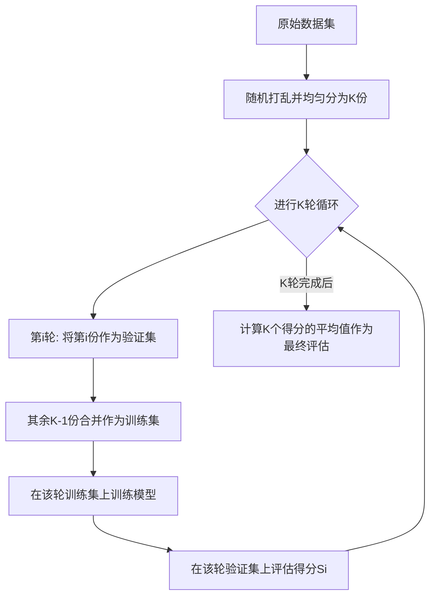

# 机器学习 (Machine Learning) 笔记

[toc]

## 机器学习 (Machine Learning)基础

### 1. 什么是机器学习？
  机器学习是人工智能的一个分支，其核心思想是让计算机通过数据进行学习，而不是通过显式的编程规则来执行任务。

  * **核心目标**：从数据中发现规律，从而对未知数据进行预测或决策。
  * **本质**：通过数学模型（函数）拟合数据分布。

### 2. 机器学习的核心分类
  机器学习通常分为以下几大类：

#### 2.1 监督学习 (Supervised Learning)
  * **定义**：模型在已知输入（特征）和输出（标签）的数据集上进行训练。
  * **典型任务**：
      * **回归 (Regression)**：预测连续值（如房价预测）。
      * **分类 (Classification)**：预测离散类别（如垃圾邮件识别）。

#### 2.2 无监督学习 (Unsupervised Learning)
  * **定义**：模型仅利用未标记的数据进行训练，尝试发现数据内在的结构。
  * **典型任务**：
      * **聚类 (Clustering)**：将数据划分为若干组（如用户群体细分）。
      * **降维 (Dimensionality Reduction)**：简化数据特征（如主成分分析 PCA）。

#### 2.3 强化学习 (Reinforcement Learning)
  * **定义**：智能体（Agent）通过与环境的交互，根据奖励（Reward）机制来学习最优策略。

### 3. 机器学习的核心流程
  一个标准的机器学习项目通常遵循以下步骤：

  1.  **数据收集**：获取原始数据。
  2.  **数据预处理**：清洗、缺失值填充、特征缩放（标准化/归一化）。
  3.  **模型选择**：根据任务选择算法（如线性回归、决策树、支持向量机等）。
  4.  **模型训练 (Fit)**：利用训练集调整模型参数。
  5.  **模型评估 (Evaluate)**：使用测试集验证模型性能（准确率、均方误差等）。
  6.  **超参数调优**：优化模型效果。

### 4. 关键概念
  * **过拟合 (Overfitting)**：模型在训练集上表现极好，但在测试集上表现较差（模型太复杂，“死记硬背”）。
  * **欠拟合 (Underfitting)**：模型在训练集和测试集上表现都不好（模型太简单）。
  * **偏差-方差权衡 (Bias-Variance Tradeoff)**：寻找模型复杂度和泛化能力之间的平衡点。

### 5. 常用工具栈
  * **NumPy**：高效数值计算。
  * **Pandas**：数据处理与分析。
  * **Matplotlib/Seaborn**：可视化。
  * **Scikit-learn (sklearn)**：机器学习算法实现的标准库。


## 机器学习 (Machine Learning) 导论

### 1. 核心定义
机器学习是人工智能（AI）的一个子领域，它赋予计算机无需通过显式编程即可“学习”的能力。
* **传统编程**：输入数据 + 规则 = 输出结果。
* **机器学习**：输入数据 + 输出结果 = 规则（模型）。

### 2. 为什么需要机器学习？
* **处理复杂任务**：当规则过于复杂（如人脸识别、语音转文字）而无法通过人工编写代码实现时。
* **适应性**：系统能随数据变化而自动更新和改进，具备自我进化的能力。
* **挖掘隐含规律**：从海量数据中发现人类难以察觉的统计学特征。

### 3. 机器学习的应用场景
* **预测类**：房价预测、股票走势、销量预估（回归任务）。
* **分类类**：邮件过滤、图像识别、信用评分（分类任务）。
* **聚类类**：客户细分、异常检测、社交网络社区发现（无监督任务）。

### 4. 机器学习的“进化”逻辑
机器学习的本质是一个迭代过程：
1. **输入数据**：模型通过观测数据。
2. **构建模型**：利用数学算法（如线性回归、神经网络）构建映射关系。
3. **误差评估**：计算预测值与真实值之间的差异（Loss）。
4. **参数优化**：调整参数以最小化误差，使其在面对新数据时表现更好。


</img>

</img>


## 机器学习 (Machine Learning) 学习路径建议

### 1. 知识储备先行
在深入算法之前，需要具备以下基础：
* **数学基础**：线性代数（矩阵运算）、概率论与统计学（基础分布与推理）、微积分（梯度与导数）。
* **编程基础**：精通 Python，尤其是数据处理库（NumPy, Pandas, Matplotlib）。

### 2. 学习的三大阶段
* **第一阶段：夯实理论基础**
    * 理解核心概念：监督/无监督/强化学习、偏差-方差权衡、过拟合/欠拟合。
    * 不要陷入纯数学公式的泥潭，重点在于理解算法的“直觉”。
* **第二阶段：工具实操**
    * 熟练使用 `Scikit-learn`：这是机器学习的入门标准库。
    * 通过“跑通”简单的算法（如线性回归、决策树、SVM）来建立对数据的敏感度。
* **第三阶段：项目驱动与竞赛**
    * 参与 Kaggle 竞赛：在真实数据集中处理脏乱数据、进行特征工程。
    * 复现经典论文或项目：通过 GitHub 寻找开源项目，动手实现并调试。

### 3. 学习心法
* **动手胜过阅读**：不要只看视频或书籍，每一行算法都应该通过代码运行一遍。
* **由浅入深**：先从简单的统计模型开始，再过渡到复杂的神经网络（深度学习）。
* **保持持续更新**：机器学习领域发展迅速，多阅读 arXiv 论文和行业技术博客。


## 机器学习项目生命周期 (Machine Learning Project Lifecycle)

### 1. 核心理念
机器学习项目不是线性的“一锤子买卖”，而是一个**迭代循环**的过程。一旦模型部署，随着数据环境的变化，还需要持续进行监测与重训练。

### 2. 标准生命周期阶段
一个完整的机器学习项目通常经历以下核心环节：

1. **定义问题 (Scoping & Problem Definition)**
   * 明确目标：判断机器学习是否是解决问题的最优方案。
   * 设定标准：确定衡量模型性能的业务指标（如准确率、召回率、F1 分数等）。
   * 框架化：将业务需求转化为具体的机器学习任务（回归、分类或聚类）。

2. **数据处理 (Data Processing)**
   * 数据获取：收集原始数据（数据库、API、文件等）。
   * 数据清洗：处理缺失值、异常值和不一致数据，确保数据质量。
   * 特征工程 (Feature Engineering)：这是最体现专家经验的一步，包括特征转换、提取和选择，旨在提高模型对数据的理解能力。

3. **建模与训练 (Modeling & Training)**
   * 模型选择：基于问题性质选择合适的算法（如逻辑回归、SVM、随机森林或深度学习模型）。
   * 训练循环：通过大量数据进行参数训练，并根据验证集表现进行超参数调优。

4. **模型评估 (Evaluation)**
   * 模型测试：使用未参与训练的测试集（Unseen Data）进行评估。
   * 误差分析：分析模型犯错的模式，反推是数据质量问题还是模型结构缺陷，从而决定是否回到“数据处理”或“建模”阶段进行迭代。

5. **部署与集成 (Deployment & Integration)**
   * 环境搭建：将训练好的模型封装（如 API 服务、容器化部署），集成到现有的业务系统或移动端应用中。

6. **监测与维护 (Monitoring & Maintenance)**
   * 持续监控：监测模型在生产环境中的性能，检测是否存在“数据漂移”（Data Drift，即线上数据分布与训练时发生变化）。
   * 迭代升级：根据反馈定期重训练模型，保证模型随环境进化。


## 机器学习如何工作

### 核心思想

机器学习核心是让计算机通过**数据学习**推断规律 / 模式，无需显式编写规则；本质是通过历史数据，自动改进决策与预测能力。

### 简化工作流程

1. 收集数据：准备含特征和标签的数据
2. 选择模型：按任务选合适机器学习算法
3. 训练模型：数据学习模式，最小化误差
4. 评估与验证：测试集评估性能并优化
5. 部署模型：投入实际场景做预测
6. 持续改进：随新数据定期更新优化

### 核心环节详解

#### 1. 数据输入：学习基础

- **输入特征**：模型预测依据（如房价预测中的面积、位置）
- **标签**：待预测结果（如房价）
- 目标：挖掘特征与标签间的关联规律

#### 2. 模型选择：匹配任务的算法

- **监督学习**：带标签数据，学输入 - 标签关系（如线性回归、逻辑回归、SVM、决策树）
- **无监督学习**：无标签数据，探索数据结构（如 K-means 聚类、PCA）
- **强化学习**：与环境互动，靠奖惩学最优行为（如 Q-learning、DQN）

#### 3. 训练过程：数据中习得规律

- 核心：通过**最小化损失函数**优化模型参数

- 步骤：

  1. 初始化：参数随机赋值
  2. 算预测：输入数据生成预测结果
  3. 算误差：对比预测值与真实标签
  4. 调参数：用梯度下降 / 反向传播缩小误差，循环至最优

  

#### 4. 验证与评估：检验模型性能

- 数据划分：**训练集**（训练用）、**测试集**（评估用，不参与训练）

- 常用指标：

  - 分类：准确率、精确率、召回率、F1 分数
  - 回归：均方误差（MSE）

  

#### 5. 优化与调整：提升模型精度

- 调超参数：学习率、正则化系数、树深度等
- 模型优化：尝试新模型或集成学习（随机森林、XGBoost）
- 数据增强：扩展数据集（如图像旋转、翻转），增强泛化能力

#### 6. 模型部署与预测：落地应用

- 部署：将训练好的模型嵌入应用、网站、服务器
- 预测：接收新数据，输出实时预测 / 分类结果

#### 7. 持续学习：长期维护

- 模型非一次性完成，需随新数据**定期更新、再训练**
- 常用方法：在线学习、迁移学习


## 常见机器学习模型对比

| 模型类型     | 中文全称       | 英文简写    | 核心适用场景                 | 优点                             | 缺点                                    |
| ------------ | -------------- | ----------- | ---------------------------- | -------------------------------- | --------------------------------------- |
| 传统机器学习 | 决策树         | DT          | 分类、回归、特征重要性分析   | 可解释性强，无需数据归一化       | 易过拟合，对噪声敏感                    |
| 传统机器学习 | 随机森林       | RF          | 分类、回归、异常检测         | 抗过拟合，稳定性高               | 高维数据下计算成本高                    |
| 传统机器学习 | 逻辑回归       | LR          | 二分类、概率预测             | 训练快，可解释性强               | 难以拟合非线性关系                      |
| 传统机器学习 | 支持向量机     | SVM         | 分类、高维小样本数据         | 泛化能力强，适合特征维度高的场景 | 对大规模数据训练慢，调参复杂            |
| 传统机器学习 | 朴素贝叶斯     | NB          | 文本分类、垃圾邮件识别       | 训练速度极快，对缺失数据不敏感   | 假设特征独立，实际场景中可能不成立      |
| 传统机器学习 | XGBoost        | XGBoost     | 分类、回归、竞赛级任务       | 精度高，支持并行计算，自带正则化 | 容易过拟合，对超参数敏感                |
| 传统机器学习 | LightGBM       | LightGBM    | 大规模数据分类、回归         | 训练速度快，内存占用低           | 小数据集上可能不如 XGBoost 稳定         |
| 深度学习     | 人工神经网络   | ANN         | 简单分类、回归任务           | 结构简单，易于理解               | 难以处理高维、复杂数据                  |
| 深度学习     | 卷积神经网络   | CNN         | 图像识别、目标检测、视频分析 | 自动提取空间特征，参数共享       | 训练需要大量数据和计算资源              |
| 深度学习     | 循环神经网络   | RNN         | 序列数据处理、文本生成       | 处理可变长度序列                 | 存在梯度消失 / 爆炸问题，难以捕捉长依赖 |
| 深度学习     | 长短期记忆网络 | LSTM        | 长序列文本翻译、语音识别     | 解决 RNN 长依赖问题              | 结构复杂，训练速度较慢                  |
| 深度学习     | 门控循环单元   | GRU         | 序列数据处理、情感分析       | 比 LSTM 结构简单，训练更快       | 长序列场景下性能略逊于 LSTM             |
| 深度学习     | 生成对抗网络   | GAN         | 图像生成、风格迁移、数据增强 | 生成数据质量高，多样性强         | 训练不稳定，容易模式崩溃                |
| 深度学习     | Transformer    | Transformer | 自然语言处理、多模态任务     | 并行计算效率高，捕捉长依赖能力强 | 计算成本高，小数据集上易过拟合          |
| 深度学习     | 自编码器       | AE          | 数据压缩、异常检测、特征提取 | 无监督学习，结构简单             | 生成数据质量通常低于 GAN                |
| 深度学习     | 图神经网络     | GNN         | 社交网络分析、分子结构预测   | 处理图结构数据，挖掘节点关系     | 训练难度大，对图结构预处理要求高        |

## 数据理解

在开始任何机器学习项目之前，比如预测房价、识别图片中的猫狗，或者推荐你喜欢的电影，我们首先需要面对一个最基础也最关键的环节：**数据理解**。

你可以把数据理解想象成一位侦探在调查案件前，仔细研究所有线索和档案的过程。如果不了解线索（数据）的来龙去脉、真伪和含义，后续的任何推理（建模）都可能建立在错误的基础上。

数据理解是整个机器学习流程的基石，它决定了我们后续如何清洗数据、选择模型，并最终影响模型的成败。

------

### 什么是数据理解？

数据理解，顾名思义，就是深入认识你手中的数据集。它的核心目标是回答以下几个问题：

- **我有什么数据？**（数据的结构和类型）
- **数据质量如何？**（数据是否干净、完整、可靠）
- **数据在"说"什么？**（数据中隐藏了哪些模式、关系和分布）

这个过程不涉及复杂的代码和算法，更多的是通过观察、统计和可视化来获得对数据的"直觉"。

------

### 数据理解的核心步骤与工具

我们将使用 Python 中最流行的数据分析库 **Pandas** 和可视化库 **Matplotlib/Seaborn** 来进行演示。请确保你已经安装了它们 (`pip install pandas matplotlib seaborn`)。

步骤一：初次见面——加载与概览

首先，我们需要把数据加载到程序中，并快速浏览其整体样貌。

### 实例

```python
import pandas as pd
import matplotlib.pyplot as plt
import seaborn as sns

# 1. 加载数据（这里以经典的鸢尾花数据集为例，你也可以加载自己的CSV文件）
# 从网络加载
url = "https://raw.githubusercontent.com/uiuc-cse/data-fa14/gh-pages/data/iris.csv"
df = pd.read_csv(url)

# 或者从本地文件加载
# df = pd.read_csv('your_dataset.csv')

# 2. 查看数据的前几行 - 第一印象
print("数据的前5行：")
print(df.head())
print("\n" + "="*50 + "\n")

# 3. 查看数据的整体信息：行数、列数、数据类型、内存占用
print("数据集的基本信息：")
print(df.info())
print("\n" + "="*50 + "\n")

# 4. 查看数据的形状（多少行，多少列）
print(f"数据集形状：{df.shape}") # 输出 (行数， 列数)
print(f"共有 {df.shape[0]} 条样本， {df.shape[1]} 个特征。")

```

**代码解析**：

- `df.head()`：像翻阅一本书的目录一样，快速查看数据的前几行，了解数据长什么样。
- `df.info()`：这是数据的"体检报告"。它会告诉你：
  - 每列的名称（`Column`）
  - 非空值的数量（`Non-Null Count`），可以立刻发现是否有数据缺失
  - 数据类型（`Dtype`），如 `int64`（整数）， `float64`（小数）， `object`（文本或混合类型）
- `df.shape`：直接获取数据表的维度。

### 步骤二：质量检查——发现缺失与异常

数据很少是完美无缺的。常见的"数据病"包括**缺失值**（某些位置是空的）和**异常值**（某些数字大得离谱或小得离谱）。

### 实例

```python
# 1. 检查缺失值
print("各特征缺失值数量：")
print(df.isnull().sum())
print("\n" + "="*50 + "\n")

# 如果缺失值很多，可以计算缺失比例
missing_ratio = df.isnull().sum() / len(df) * 100
print("各特征缺失值比例（%）:")
print(missing_round)
print("\n" + "="*50 + "\n")

# 2. 检查数值型特征的统计摘要 - 可以发现异常值的线索
print("数值型特征的统计描述：")
print(df.describe())

```

**代码解析**：

- `df.isnull().sum()`：计算每一列中空值（`NaN`）的总数。
- `df.describe()`：生成数值列的统计摘要，包括：
  - `count`：数量（可用于再次确认缺失）
  - `mean`：平均值
  - `std`：标准差（数据波动大小）
  - `min`：最小值
  - `25%`, `50%`（中位数）, `75%`：四分位数
  - `max`：最大值
  - **通过观察 `min` 和 `max`，你可以初步判断是否有异常值**（例如，年龄列出现 200 岁）。

### 步骤三：深入洞察——分布与关系可视化

文字和数字是抽象的，而图表能让我们直观地"看到"数据。这是数据理解中最有趣的部分。

### 实例

```python
# 设置图表风格
sns.set(style="whitegrid")

# 1. 单变量分布 - 了解每个特征自身的分布情况
fig, axes = plt.subplots(2, 2, figsize=(12, 8)) # 创建2x2的画布
features = ['sepal_length'， 'sepal_width'， 'petal_length'， 'petal_width']
colors = ['skyblue'， 'lightgreen'， 'salmon'， 'gold']

for i, (ax, feature, color) in enumerate(zip(axes.flat, features, colors)):
  # 绘制直方图（分布）与核密度估计曲线
  sns.histplot(df[feature], kde=True, ax=ax, color=color, bins=20)
  ax.set_title(f'{feature} 的分布'， fontsize=14)
  ax.set_xlabel(feature)
  ax.set_ylabel('频数')

plt.tight_layout()
plt.show()

# 2. 箱线图 - 查看数据分布与异常值（更直观）
plt.figure(figsize=(10, 6))
# 选择数值列绘制箱线图
df_box = df.drop(columns=['species']) # 假设'species'是文本标签列，先去掉
sns.boxplot(data=df_box)
plt.title('各数值特征的箱线图（查看分布与异常值）'， fontsize=14)
plt.xticks(rotation=45)
plt.show()

# 3. 变量间关系 - 散点图矩阵
print("\n绘制特征间关系的散点图矩阵...（这能帮助我们发现特征之间的关联）")
# 使用Seaborn的pairplot， hue参数可以根据类别着色（如鸢尾花的品种）
sns.pairplot(df, hue='species'， height=2.5)
plt.suptitle('特征关系散点图矩阵（按种类着色）'， y=1.02, fontsize=16)
plt.show()

# 4. 相关性热力图 - 量化特征间的线性关系
plt.figure(figsize=(8, 6))
# 计算数值特征之间的相关系数
numeric_df = df.select_dtypes(include=['float64'， 'int64'])
correlation_matrix = numeric_df.corr()
sns.heatmap(correlation_matrix, annot=True, cmap='coolwarm'， center=0, square=True)
plt.title('特征相关性热力图'， fontsize=14)
plt.show()

```

**图表解析**：

- **直方图**：展示了某个特征（如花瓣长度）的值是如何分布的。是集中在某个区间，还是分散的？
- **箱线图**：
  - 箱子中间的线代表**中位数**。
  - 箱子的上下边界代表**第25%（Q1）和75%（Q3）分位数**。
  - 上下延伸的"须"通常代表合理范围（Q1-1.5IQR 到 Q3+1.5IQR）。
  - **单独的点**很可能就是**异常值**！
- **散点图矩阵**：同时查看任意两个特征之间的关系。点呈带状分布说明可能相关。
- **相关性热力图**：用颜色和数字（-1 到 1）精确表示两个特征的线性相关程度。
  - **1**：完全正相关（一个变大，另一个也变大）
  - **-1**：完全负相关（一个变大，另一个变小）
  - **0**：没有线性关系

------

### 数据理解的产出：一份"数据调查报告"

完成上述步骤后，你应该能总结出一份关于当前数据集的清晰报告，例如：

> **关于鸢尾花数据集的调查报告**
>
> **数据概览**：共 150 条样本，5 个特征（4个数值特征：花萼/花瓣的长宽；1个类别标签：品种）。
>
> **数据质量**：无缺失值，所有数值特征均在合理生物范围内，未发现明显异常值。
>
> **数据洞察**：
>
> - 花瓣长度（`petal_length`）和花瓣宽度（`petal_width`）相关性极高（>0.96），可能存在信息冗余。
> - 不同品种的鸢尾花在花瓣尺寸上区分明显，散点图能清晰聚类。
> - 花萼宽度（`sepal_width`）的分布近似正态分布。


## 数据清洗

在机器学习中，我们常常听到一句话："垃圾进，垃圾出"，这句话生动地比喻了数据质量对于模型性能的决定性影响。

想象一下，你是一位大厨，准备烹饪一道美味佳肴。即使你的厨艺再高超，如果食材不新鲜、有泥沙或者残缺不全，最终做出的菜肴也必然大打折扣。

在机器学习中，**原始数据**就是我们的"食材"，而**数据清洗**就是那个至关重要的"备菜"过程。它旨在识别、纠正或移除数据中的错误、不一致、重复和不完整的部分，为后续的模型"烹饪"准备好干净、高质量的"食材"。

本文将带你系统性地了解数据清洗的核心概念、常用方法，并通过清晰的代码示例，让你掌握这项数据科学家的必备技能。

------

## 一、 数据清洗为何如此重要？

在深入技术细节之前，让我们先理解为什么数据清洗是机器学习流程中不可或缺的一环。

### 1.1 提升模型性能与准确性

脏数据（如异常值、错误值）会误导模型学习错误的规律。清洗后的干净数据能让模型更准确地捕捉数据中的真实模式，从而做出更可靠的预测。

### 1.2 保证分析结果的可靠性

无论是探索性数据分析还是最终的商业决策，基于错误数据得出的结论都是危险的。数据清洗确保了分析基础的坚实可靠。

### 1.3 提高算法稳定性

许多机器学习算法对数据质量非常敏感。例如，基于距离的算法（如 KNN、SVM）会受异常值的严重影响，而缺失值可能导致整个样本无法被使用。

### 1.4 节省计算资源与时间

清洗掉无关、重复的数据可以减少数据集大小，从而降低模型训练的计算成本和时间。

为了更直观地理解数据清洗在机器学习全流程中的位置，请看下面的流程图：


从上图可以看出，数据清洗是预处理的第一步，并且当模型效果不佳时，我们常常需要回溯到这一步来检查并改进数据质量。

------

## 二、 常见的数据问题与清洗策略

数据清洗通常针对以下几类常见问题展开。我们可以通过一个简单的表格来快速了解：

| 问题类型     | 描述                                                | 可能的影响                             | 常用清洗策略                          |
| :----------- | :-------------------------------------------------- | :------------------------------------- | :------------------------------------ |
| **缺失值**   | 数据记录中某些字段的值为空（NaN, NULL）。           | 导致样本被丢弃，信息损失，计算错误。   | 删除、填充（均值/中位数/众数/预测）。 |
| **异常值**   | 与大多数数据明显偏离的极端值。                      | 扭曲统计结果，影响模型性能。           | 识别（IQR、Z-Score）后删除或修正。    |
| **重复值**   | 数据集中存在完全相同的记录。                        | 使模型过度偏向重复样本，影响泛化能力。 | 识别并删除重复项。                    |
| **不一致性** | 数据格式、单位或编码不统一（如"男"、"Male"、"M"）。 | 导致分组和分析错误。                   | 标准化、规范化、映射转换。            |
| **错误值**   | 明显不合逻辑的值（如年龄为-1或300岁）。             | 产生毫无意义的分析结果。               | 根据业务逻辑进行修正或设为缺失。      |

接下来，我们将使用 Python 的 `pandas` 和 `numpy` 库，通过具体代码来演示如何解决这些问题。

------

## 三、 动手实践：使用 Python 进行数据清洗

假设我们有一个名为 `customer_data.csv` 的客户数据集，它包含了一些典型的数据质量问题。

### 3.1 环境准备与数据加载

首先，确保你已安装必要的库，然后加载数据。

## 实例

```python
# 导入必要的库
import pandas as pd
import numpy as np

# 加载数据集
df = pd.read_csv('customer_data.csv') # 请替换为你的文件路径

# 查看数据的基本信息和前几行
print("数据集形状（行，列）:", df.shape)
print("\n数据前5行：")
print(df.head())
print("\n数据基本信息：")
print(df.info())
print("\n数据统计描述：")
print(df.describe())

```

### 3.2 处理缺失值

发现缺失值是第一步。`pandas` 提供了方便的方法。

## 实例

```python
# 1. 检查缺失值
print("各列缺失值数量：")
print(df.isnull().sum())

# 2. 处理缺失值 - 方法一：删除
# 删除任何包含缺失值的行（适用于缺失值很少的情况）
df_dropped = df.dropna()
print(f"\n删除缺失值后，数据形状: {df_dropped.shape}")

# 3. 处理缺失值 - 方法二：填充
# 更常用的方法是根据列的特性进行填充
df_filled = df.copy()

# 对于数值型列（如'年龄'），用中位数填充（比均值更抗异常值影响）
if '年龄' in df_filled.columns:
  df_filled['年龄'].fillna(df_filled['年龄'].median(), inplace=True)

# 对于分类列（如'城市'），用众数（最频繁出现的值）填充
if '城市' in df_filled.columns:
  df_filled['城市'].fillna(df_filled['城市'].mode()[0], inplace=True)

# 对于可能随时间变化的列（如'上次消费金额'），有时用0填充更有业务意义
if '上次消费金额' in df_filled.columns:
  df_filled['上次消费金额'].fillna(0, inplace=True)

print("\n填充缺失值后，各列缺失值数量：")
print(df_filled.isnull().sum())

```

### 3.3 识别与处理异常值

异常值处理需要谨慎，因为有时它们代表了重要的特殊事件。

## 实例

```python
# 我们以'年收入'为例，假设它应该是一个合理的正值
if '年收入' in df_filled.columns:
  # 方法一：使用四分位距（IQR）法识别
  Q1 = df_filled['年收入'].quantile(0.25)
  Q3 = df_filled['年收入'].quantile(0.75)
  IQR = Q3 - Q1
  lower_bound = Q1 - 1.5 * IQR
  upper_bound = Q3 + 1.5 * IQR

  # 找出异常值
  outliers = df_filled[(df_filled['年收入'] < lower_bound) | (df_filled['年收入'] > upper_bound)]
  print(f"\n使用IQR法发现的'年收入'异常值数量: {len(outliers)}")

  # 处理异常值：这里选择用上下边界值进行截断（Winsorization）
  df_filled['年收入'] = np.where(df_filled['年收入'] > upper_bound, upper_bound,
                  np.where(df_filled['年收入'] < lower_bound, lower_bound, df_filled['年收入']))

  print("已对'年收入'的异常值进行截断处理。")

```

### 3.4 处理重复值

重复的记录会增加计算负担并可能带来偏差。

## 实例

```python
# 检查并删除完全重复的行
duplicate_rows = df_filled.duplicated()
print(f"\n发现完全重复的行数: {duplicate_rows.sum()}")

# 删除这些重复行，只保留第一次出现的记录
df_cleaned = df_filled.drop_duplicates()
print(f"删除重复值后，数据形状: {df_cleaned.shape}")

```

### 3.5 处理不一致性

确保数据格式和值的统一。

## 实例

```python
# 1. 标准化文本格式：例如，将'城市'列统一为首字母大写
if '城市' in df_cleaned.columns:
  df_cleaned['城市'] = df_cleaned['城市'].str.title()

# 2. 映射统一值：例如，将性别信息统一为'男'和'女'
if '性别' in df_cleaned.columns:
  gender_mapping = {'male': '男', 'female': '女', 'M': '男', 'F': '女'}
  df_cleaned['性别'] = df_cleaned['性别'].replace(gender_mapping)
  # 也可以使用 .map() 函数，但 .replace() 更灵活，未指定的值保持不变

# 3. 转换数据类型：确保数值列是数字类型
if '年龄' in df_cleaned.columns:
  df_cleaned['年龄'] = pd.to_numeric(df_cleaned['年龄'], errors='coerce') # errors='coerce'将错误转换为NaN
  # 转换后，可以再次用中位数填充因转换产生的新NaN
  df_cleaned['年龄'].fillna(df_cleaned['年龄'].median(), inplace=True)

print("\n数据清洗完成！查看清洗后的数据前5行：")
print(df_cleaned.head())

```

------

## 四、 总结与最佳实践

通过上面的步骤，我们已经完成了一轮基本的数据清洗。记住，数据清洗不是一个一次性的步骤，而是一个迭代的过程。以下是一些最佳实践：

1. **先探索，后清洗**：在动手清洗之前，务必使用 `df.describe()`、`df.info()`、可视化（如直方图、箱线图）等手段充分了解你的数据。
2. **备份原始数据**：永远保留一份原始的、未经修改的数据副本。所有清洗操作都应在副本上进行。
3. **记录清洗步骤**：将你的清洗逻辑（如为什么用中位数填充、异常值的边界如何确定）记录下来。这对于项目可复现性和团队协作至关重要。
4. **结合业务逻辑**：数据清洗不是纯数学操作。例如，"年龄=0"在人口统计数据中是错误，但在婴幼儿产品数据中可能是合理的。始终与领域专家保持沟通。
5. **迭代进行**：清洗后，进入建模阶段。如果模型效果不佳，应回头检查数据质量，可能需要调整清洗策略。

数据清洗可能占到一个数据科学项目 **60%-80%** 的时间，虽然繁琐，但它是构建强大、可靠机器学习模型的基石。掌握了它，你就为成为优秀的数据科学家迈出了坚实的一步。


## 特征工程

想象一下，你是一位厨师，要做一道美味的菜肴，机器学习模型就像你的"烹饪算法"，而原始数据就是你从市场买回来的各种食材：有蔬菜、肉类、调料，但可能有些是带泥的，有些是整块的，有些味道很冲。**特征工程**，就是将这些原始"食材"进行清洗、切割、腌制、搭配，最终处理成可以直接下锅烹饪的"半成品"的过程，它是连接原始数据与机器学习模型的桥梁，是决定模型性能上限的关键步骤。

简单来说，**特征工程**是利用领域知识，通过一系列技术手段，从原始数据中提取、构造、选择出对机器学习模型更有价值、更易学习的特征（变量）的过程。

------

## 一、为什么特征工程如此重要？

在机器学习项目中，数据和特征的质量直接决定了模型性能的上限，而模型和算法只是逼近这个上限。一个优秀的特征工程可以：

1. **提升模型性能**：好的特征能让模型更容易发现数据中的规律。
2. **加速模型训练**：减少无关或冗余特征，可以降低计算复杂度。
3. **增强模型泛化能力**：防止模型过拟合于训练数据中的噪声。
4. **适应模型需求**：不同的模型对数据有不同的假设（如线性模型假设线性关系），特征工程可以使数据满足这些假设。

我们可以用以下流程图来直观理解特征工程在整个机器学习流程中的位置：


------

## 二、特征工程的核心操作

特征工程主要包含三大类操作：**特征处理**、**特征构造**和**特征选择**。

### 1. 特征处理

这是最基础的一步，目的是将原始数据"清洗"成干净、规整的格式。

#### a) 处理缺失值

数据中经常存在缺失值（如 `NaN`, `NULL`），需要合理处理。

| 处理方法 | 说明                                                    | 适用场景                       |
| :------- | :------------------------------------------------------ | :----------------------------- |
| **删除** | 直接删除缺失值所在的行或列                              | 缺失数据极少，或该特征不重要时 |
| **填充** | 用某个值填充，如均值、中位数、众数或一个特殊值（如 -1） | 最常用的方法，适用于各种情况   |
| **插值** | 用时间序列或相邻数据点进行插值计算                      | 时间序列数据                   |

**代码示例（使用 Python 的 pandas 库）：**

## 实例

```python
import pandas as pd
import numpy as np

# 创建一个包含缺失值的示例 DataFrame
data = {'年龄': [25, np.nan, 30, 35, np.nan],
    '工资': [50000, 54000, np.nan, 62000, 58000],
    '城市': ['北京', '上海', '广州', np.nan, '北京']}
df = pd.DataFrame(data)
print("原始数据：")
print(df)

# 1. 删除缺失值（删除任何包含 NaN 的行）
df_dropped = df.dropna()
print("\n删除缺失值后：")
print(df_dropped)

# 2. 填充缺失值
# 数值列用均值填充
df_filled = df.copy()
df_filled['年龄'].fillna(df_filled['年龄'].mean(), inplace=True)
df_filled['工资'].fillna(df_filled['工资'].mean(), inplace=True)
# 类别列用众数填充
df_filled['城市'].fillna(df_filled['城市'].mode()[0], inplace=True)
print("\n填充缺失值后：")
print(df_filled)

```

#### b) 处理异常值

异常值是与大部分数据明显不同的值，可能会干扰模型。常用检测方法有：

- **标准差法**：认为超出均值 ± 3倍标准差范围的值是异常值。
- **箱线图法**：认为小于 `Q1 - 1.5*IQR` 或大于 `Q3 + 1.5*IQR` 的值是异常值（`IQR = Q3 - Q1`）。

处理方式可以是删除、替换为边界值或视为缺失值处理。

#### c) 数据标准化/归一化

许多模型（如 SVM、KNN、神经网络）对特征的尺度敏感。我们需要将不同尺度的特征转换到同一尺度。

| 方法       | 公式                      | 说明                         | 适用场景                     |
| :--------- | :------------------------ | :--------------------------- | :--------------------------- |
| **标准化** | `(x - 均值) / 标准差`     | 处理后数据均值为0，标准差为1 | 数据分布近似正态分布时       |
| **归一化** | `(x - min) / (max - min)` | 将数据缩放到 [0, 1] 区间     | 数据边界明确，需要快速计算时 |

**代码示例（使用 scikit-learn 库）：**

## 实例

```python
from sklearn.preprocessing import StandardScaler, MinMaxScaler
import numpy as np

# 示例数据
data = np.array([[1000, 25],
         [1500, 30],
         [800, 20],
         [1200, 28]])

# 标准化
scaler_standard = StandardScaler()
data_standardized = scaler_standard.fit_transform(data)
print("标准化后的数据（均值~0， 标准差~1）：")
print(data_standardized)
print(f"均值： {data_standardized.mean(axis=0)}")
print(f"标准差： {data_standardized.std(axis=0)}")

# 归一化
scaler_minmax = MinMaxScaler()
data_normalized = scaler_minmax.fit_transform(data)
print("\n归一化后的数据（范围[0,1]）：")
print(data_normalized)

```

### 2. 特征构造

通过组合或转换现有特征，创造出新的、更具预测力的特征。

#### a) 对数值特征进行变换

- **多项式特征**：创建特征的平方、立方等，帮助线性模型学习非线性关系。
- **分箱**：将连续年龄分为"青年"、"中年"、"老年"等区间，将连续数据离散化。
- **数学变换**：使用对数、指数等变换改变数据分布。

#### b) 对类别特征进行编码

机器学习模型无法直接处理"北京"、"上海"这样的文本。需要将其转换为数字。

| 方法         | 说明                                             | 特点                                               |
| :----------- | :----------------------------------------------- | :------------------------------------------------- |
| **标签编码** | 为每个类别分配一个唯一整数，如 `北京:0， 上海:1` | 简单，但可能引入错误的顺序关系（模型可能认为 1>0） |
| **独热编码** | 为每个类别创建一个新的二进制特征（0或1）         | 能消除顺序误解，但若类别很多，会导致特征维度爆炸   |

**代码示例：**

## 实例

```python
import pandas as pd
from sklearn.preprocessing import LabelEncoder, OneHotEncoder

# 示例数据
df_cat = pd.DataFrame({'城市': ['北京', '上海', '广州', '北京', '深圳']})

# 标签编码
le = LabelEncoder()
df_cat['城市_标签编码'] = le.fit_transform(df_cat['城市'])
print("标签编码结果：")
print(df_cat)

# 独热编码
# 方法1: 使用 pandas 的 get_dummies
df_onehot_pd = pd.get_dummies(df_cat['城市'], prefix='城市')
print("\n使用 pandas 进行独热编码：")
print(df_onehot_pd)

# 方法2: 使用 sklearn 的 OneHotEncoder (更常用于管道)
ohe = OneHotEncoder(sparse_output=False) # sparse_output=False 返回数组而非稀疏矩阵
encoded_array = ohe.fit_transform(df_cat[['城市']]) # 注意输入是二维的
print("\n使用 sklearn 进行独热编码（数组形式）：")
print(encoded_array)
print("新特征名称：", ohe.get_feature_names_out())

```

### 3. 特征选择

从所有特征中挑选出最重要的一个子集，以降低维度、减少过拟合风险。

| 方法       | 说明                                                         |
| :--------- | :----------------------------------------------------------- |
| **过滤法** | 根据特征与目标变量的统计相关性（如方差、卡方检验、互信息）进行排序筛选。独立于任何模型。 |
| **包裹法** | 将特征选择看作一个搜索问题，使用模型性能作为评价标准（如递归特征消除 RFE）。效果较好，但计算成本高。 |
| **嵌入法** | 在模型训练过程中自动进行特征选择（如 L1 正则化 LASSO 回归、树模型的特征重要性）。 |

**代码示例（基于特征重要性进行选择）：**

## 实例

```python
from sklearn.datasets import load_breast_cancer
from sklearn.ensemble import RandomForestClassifier
import pandas as pd
import matplotlib.pyplot as plt

# 加载数据集
data = load_breast_cancer()
X = pd.DataFrame(data.data, columns=data.feature_names)
y = data.target

# 训练一个随机森林模型，它会计算特征重要性
model = RandomForestClassifier(n_estimators=100, random_state=42)
model.fit(X, y)

# 获取特征重要性
importances = model.feature_importances_
feature_importance_df = pd.DataFrame({
  '特征': data.feature_names,
  '重要性': importances
}).sort_values('重要性', ascending=False)

print("特征重要性排序：")
print(feature_importance_df.head(10)) # 查看最重要的10个特征

# 可视化
plt.figure(figsize=(10, 6))
plt.barh(feature_importance_df['特征'][:10], feature_importance_df['重要性'][:10])
plt.xlabel('特征重要性')
plt.title('Top 10 特征重要性')
plt.gca().invert_yaxis() # 让最重要的在顶部
plt.show()

# 假设我们选择重要性大于0.03的特征
selected_features = feature_importance_df[feature_importance_df['重要性'] > 0.03]['特征'].tolist()
print(f"\n筛选出的特征： {selected_features}")

```

------

## 三、实践练习：动手处理一个简单数据集

**任务**：对著名的泰坦尼克号乘客数据集进行基础的特征工程，为预测乘客是否生还做准备。

**步骤提示**：

1. 加载数据（可使用 `seaborn` 库中的 `load_dataset('titanic')`）。
2. 观察数据：查看特征类型、缺失值情况。
3. 特征处理：
   - 处理缺失值（如用中位数填充`age`，用众数填充`embarked`）。
   - 将`sex`（性别）特征进行**标签编码**或**独热编码**。
   - 对`age`（年龄）进行**分箱**，创建新的年龄段特征。
4. 特征构造：
   - 结合`sibsp`（兄弟姐妹/配偶数）和`parch`（父母/子女数），构造新的`family_size`（家庭规模）特征。
5. 特征选择：
   - 删除你认为明显无关的特征（如`passenger_id`, `name`, `ticket`）。
   - 尝试计算数值特征与生存目标的相关性，筛选特征。

通过这个练习，你将亲身体会到，原始数据如何通过一步步的特征工程，变得对机器学习模型更加"友好"。

## 总结

特征工程是机器学习中一门结合了**艺术**（领域知识、经验、直觉）与**科学**（统计方法、算法）的技艺。它没有一成不变的规则，需要根据具体数据、问题和模型反复尝试和迭代。对于初学者，掌握本文介绍的基础方法并勤加练习，你就已经为构建有效的机器学习模型打下了最坚实的一块基石。记住，**优秀的模型往往源于优秀的特征**。

## 数据可视化

在开始构建一个复杂的机器学习模型之前，我们首先要做的不是选择算法，而是**理解数据**。

如果把机器学习比作烹饪，那么数据就是食材。

一个优秀的厨师必须了解食材的特性——是新鲜还是变质，是偏甜还是偏酸，是适合炖煮还是快炒。

数据可视化，就是我们观察和品尝数据这道食材的**放大镜**和**味蕾**。

数据可视化通过图表、图形等视觉元素，将枯燥的数字转化为直观的图像，帮助我们：

- **发现数据中的模式和趋势**（例如：销售额是否随季节变化？）
- **识别异常值和错误数据**（例如：年龄为 300 岁的记录）
- **理解特征（变量）之间的关系**（例如：房屋面积和价格是否正相关？）
- **验证假设**，并为后续的特征工程和模型选择提供依据。

本文将使用 Python 中最流行的数据科学库 `pandas` 和可视化库 `matplotlib`、`seaborn`，带你掌握数据可视化的核心技能。

------

## 准备工作：环境与数据

在开始画图之前，我们需要准备好"画布"和"颜料"。

### 安装必要的库

如果你使用的是 Anaconda，这些库通常已预装。否则，可以通过以下命令安装：

```
pip install pandas matplotlib seaborn
```

### 导入库与加载数据

我们将使用一个经典的公开数据集：泰坦尼克号乘客数据集。它包含了乘客的生存情况、舱位、年龄、性别等信息。

## 实例

```python
# 导入必要的库
import pandas as pd
import matplotlib.pyplot as plt
import seaborn as sns

# 设置图表风格，让图表更好看
sns.set_style("whitegrid")
# -------------------------- 设置中文字体 start --------------------------
plt.rcParams['font.sans-serif'] = [
  # Windows 优先
  'SimHei', 'Microsoft YaHei',
  # macOS 优先
  'PingFang SC', 'Heiti TC',
  # Linux 优先
  'WenQuanYi Micro Hei', 'DejaVu Sans'
]
# 修复负号显示为方块的问题
plt.rcParams['axes.unicode_minus'] = False
# -------------------------- 设置中文字体 end --------------------------

# 加载数据
# 这里我们直接从 seaborn 的内置数据集加载
df = sns.load_dataset('titanic')

# 查看数据的前几行和基本信息
print("数据形状（行数，列数）:", df.shape)
print("\n数据前5行：")
print(df.head())
print("\n数据基本信息（类型、非空值数量等）：")
print(df.info())

```

运行上面的代码，你会看到数据有 891 行（乘客）和 15 列（特征）。`df.head()` 可以让你对数据长什么样有一个初步的印象。

------

## 单变量分析：了解单个特征的分布

单变量分析关注**一个**特征（变量）的分布情况。这是最基础的分析。

### 1. 数值型特征：直方图与箱线图

对于像 `age`（年龄）、`fare`（票价）这样的连续数值型特征，我们常用**直方图**和**箱线图**。

**直方图**展示了数据在不同区间（"桶"）内的频率分布。

## 实例

```python
# 导入必要的库
import pandas as pd
import matplotlib.pyplot as plt
import seaborn as sns

# 设置图表风格，让图表更好看
sns.set_style("whitegrid")
# -------------------------- 设置中文字体 start --------------------------
plt.rcParams['font.sans-serif'] = [
  # Windows 优先
  'SimHei', 'Microsoft YaHei',
  # macOS 优先
  'PingFang SC', 'Heiti TC',
  # Linux 优先
  'WenQuanYi Micro Hei', 'DejaVu Sans'
]
# 修复负号显示为方块的问题
plt.rcParams['axes.unicode_minus'] = False
# -------------------------- 设置中文字体 end --------------------------

# 加载数据
# 这里我们直接从 seaborn 的内置数据集加载
df = sns.load_dataset('titanic')

# 查看数据的前几行和基本信息
print("数据形状（行数，列数）:", df.shape)
print("\n数据前5行：")
print(df.head())
print("\n数据基本信息（类型、非空值数量等）：")
print(df.info())

# 绘制年龄的直方图
plt.figure(figsize=(10, 6)) # 设置图表大小
plt.hist(df['age'].dropna(), bins=30, edgecolor='black', alpha=0.7) # dropna() 忽略缺失值
plt.title('乘客年龄分布直方图')
plt.xlabel('年龄')
plt.ylabel('频数')
plt.show()

```


**解读**：这张图可以告诉我们乘客的年龄主要集中在哪个区间（例如 20-30 岁），分布是否对称，是否有异常值等。

**箱线图**可以清晰地显示数据的**中位数、四分位数和异常值**。

## 实例

```python
# 绘制票价的箱线图
plt.figure(figsize=(8, 5))
plt.boxplot(df['fare'].dropna())
plt.title('票价箱线图')
plt.ylabel('票价')
plt.show()

```

**解读**：箱体中间的线是中位数。箱体上下边界是上四分位数（Q3）和下四分位数（Q1）。上下"胡须"通常延伸到 1.5 倍四分位距以内的最远数据点，之外的点被视为**异常值**（图中上方的圆圈）。这张图立刻告诉我们，票价存在很多极高的异常值。

### 2. 类别型特征：柱状图

对于像 `sex`（性别）、`embarked`（登船港口）、`survived`（是否幸存）这样的类别型特征，我们使用**柱状图**来统计每个类别的数量。

## 实例

```python
# 绘制乘客性别的柱状图
survival_counts = df['sex'].value_counts()
plt.figure(figsize=(8, 5))
plt.bar(survival_counts.index, survival_counts.values, color=['lightblue', 'lightcoral'])
plt.title('乘客性别分布')
plt.xlabel('性别')
plt.ylabel('人数')
plt.show()

```

------

## 双变量分析：探索特征间的关系

双变量分析探索**两个**特征之间的关系。

### 1. 数值 vs 数值：散点图

散点图是研究两个连续变量相关性的利器。

## 实例

```python
# 绘制年龄与票价的散点图
plt.figure(figsize=(10, 6))
plt.scatter(df['age'], df['fare'], alpha=0.5) # alpha 设置透明度，便于观察点密度
plt.title('年龄 vs 票价 散点图')
plt.xlabel('年龄')
plt.ylabel('票价')
plt.show()

```

- **解读**：点的分布模式可以暗示相关性。例如，如果点大致沿一条斜线分布，则说明两者相关。从这张图看，年龄和票价没有明显的线性关系，但能再次确认高票价（异常值）的存在。

### 2. 类别 vs 数值：分组箱线图或小提琴图

我们常常想知道不同类别下，某个数值特征的分布有何不同。例如："不同舱位的乘客，票价分布有何差异？"

## 实例

```python
# 使用 seaborn 绘制分组箱线图 (pclass: 舱位等级，1/2/3等舱)
plt.figure(figsize=(10, 6))
sns.boxplot(x='pclass', y='fare', data=df)
plt.title('不同舱位的票价分布')
plt.show()

```

- **解读**：非常清晰！舱位等级越高（1 等舱），票价的中位数和整体范围都显著更高。这完全符合我们的常识。

**小提琴图**是箱线图的高级版本，它不仅显示了统计量，还通过核密度估计展示了数据的实际分布形状。

## 实例

```python
# 绘制不同性别下年龄分布的小提琴图
plt.figure(figsize=(10, 6))
sns.violinplot(x='sex', y='age', data=df, inner='quartile') # inner 参数显示四分位线
plt.title('不同性别的年龄分布（小提琴图）')
plt.show()

```

### 3. 类别 vs 类别：堆叠柱状图或热力图

对于两个类别型变量，我们可以用**堆叠柱状图**来观察组合情况。例如："不同性别的幸存比例如何？"

## 实例

```python
# 创建性别与生存情况的交叉表
cross_tab = pd.crosstab(df['sex'], df['survived'], normalize='index') # normalize='index' 按行计算比例
print(cross_tab)

# 绘制堆叠柱状图
cross_tab.plot(kind='bar', stacked=True, figsize=(10, 6), color=['tomato', 'lightgreen'])
plt.title('不同性别的生存比例')
plt.xlabel('性别')
plt.ylabel('比例')
plt.legend(['未幸存', '幸存'])
plt.show()

```

**解读**：从图表和交叉表可以明显看出，女性的幸存比例远高于男性。这是一个非常强的信号，说明 `sex` 特征对于预测生存至关重要。

------

## 多变量分析与高级可视化

有时我们需要同时考虑三个甚至更多变量。`seaborn` 库让这变得简单。

### 1. 带分组的散点图

我们可以在散点图的基础上，用颜色或形状区分第三个（类别型）变量。

## 实例

```python
# 在年龄-票价散点图中，用颜色区分是否幸存
plt.figure(figsize=(12, 8))
sns.scatterplot(x='age', y='fare', hue='survived', style='survived', data=df, alpha=0.7)
plt.title('年龄 vs 票价（按生存情况着色）')
plt.show()

```

- **解读**：这张图可以让我们直观地感受，幸存者（橙色）和非幸存者（蓝色）在"年龄-票价"这个二维空间中的分布是否有区别。

### 2. 相关矩阵热力图

当我们有多个数值特征时，可以一次性计算它们两两之间的相关系数，并用热力图展示。

## 实例

```python
# 选择数值型列
numeric_df = df.select_dtypes(include=['float64', 'int64'])

# 计算相关系数矩阵
corr_matrix = numeric_df.corr()

# 绘制热力图
plt.figure(figsize=(12, 8))
sns.heatmap(corr_matrix, annot=True, cmap='coolwarm', center=0, square=True)
plt.title('数值特征相关矩阵热力图')
plt.show()

```

**解读**：颜色越暖（红），表示正相关性越强；越冷（蓝），表示负相关性越强。`annot=True` 将具体数值显示在方格内。例如，`pclass`（舱位）和 `fare`（票价）呈强负相关（-0.55），即舱位号越小（等级越高），票价越高，这与我们之前的分析一致。

------

## 实践练习：动手探索

现在，请你尝试完成以下练习，巩固所学知识：

1. **数据检查**：使用 `df.isnull().sum()` 查看数据集中哪些列有缺失值，缺失了多少。
2. **绘制分布**：为 `age` 列绘制一个**小提琴图**，并按照 `survived`（生存情况）进行分组（使用 `sns.violinplot(x='survived', y='age', data=df)`）。观察幸存者和非幸存者的年龄分布有何不同。
3. **探索关系**：使用 `sns.countplot(x='pclass', hue='survived', data=df)` 绘制一个计数柱状图，查看不同舱位等级的幸存人数对比。你能得出什么结论？
4. **（挑战）多变量图**：尝试绘制一个**散点图矩阵**，一次性查看 `age`、`fare`、`parch`（父母/子女数量） 这几个数值变量两两之间的关系。提示：可以使用 `sns.pairplot(df[['age', 'fare', 'parch', 'survived']], hue='survived')`。

## 总结

数据可视化是机器学习工作流中**不可或缺的探索性步骤**。通过本文，你学会了：

**核心工具**：使用 `matplotlib` 进行基础绘图，使用 `seaborn` 绘制更美观、信息量更丰富的统计图形。

**分析思路**：

- **单变量分析**：用直方图/箱线图看分布，用柱状图数个数。
- **双变量分析**：用散点图看数值关系，用分组箱线图看类别对数值的影响，用堆叠柱状图看类别组合。
- **多变量分析**：用着色散点图、相关热力图揭示更复杂的模式。

**核心目标**：所有图表都是为了**提出假设**和**发现洞察**，例如性别可能是一个重要的预测特征、票价数据中有大量异常值需要处理。

记住，在把数据喂给模型之前，请务必花时间好好看看它。一个清晰的可视化发现，往往能比复杂的算法更早地指引你走向正确的方向。


## 训练集测试集划分

在机器学习的世界里，数据是驱动一切模型的燃料，然而，如何正确地使用这些燃料，决定了你的模型是能精准预测未来的智能引擎，还是一个只会死记硬背的复读机。

今天，我们将深入探讨机器学习中一个至关重要且基础的概念：**训练集与测试集的划分**。这是你构建任何可靠模型的第一步，也是评估模型真实能力的关键。

简单来说，训练集和测试集的划分，就像学生时代的学习与考试：

- **训练集** 是学生的教材和练习题，模型用它来学习数据中的规律和模式。
- **测试集** 是最终的期末考试，模型用它来检验自己是否真正掌握了知识，而不是仅仅记住了练习题（训练集）的答案。

------

## 为什么必须划分训练集和测试集？

想象一下，如果一个学生只复习了老师给的模拟题，并且考试题目就是一模一样的模拟题，他得了满分。这能证明他真正理解了这个学科吗？显然不能。他可能只是记住了答案。

在机器学习中，如果我们在**全部数据**上训练模型，然后又用这**同一份数据**去评估它的性能，就会犯同样的错误。模型会表现得异常出色，因为它已经"见过"并"记住"了所有数据的细节，包括其中的噪声和偶然性。这种现象被称为**过拟合**。

过拟合的模型就像一个只会背诵例题的学生，一旦遇到新的、没见过的题目（新数据），就会表现得很差。它的"泛化能力"很弱。

因此，我们必须将数据分成两部分：

1. **训练集**：用于**教**模型，让它学习。
2. **测试集**：用于**考**模型，评估它处理**从未见过的新数据**的能力。

测试集必须与训练集完全隔离，在整个模型训练过程中都**不能**被模型看到。只有这样，测试集上的评估结果才能客观地反映模型的真实泛化能力。

------

## 如何划分：常用方法与策略

划分数据听起来简单，但其中也有不少学问。不同的划分策略适用于不同的场景。

### 1. 简单随机划分

这是最基础、最常用的方法。将整个数据集随机打乱，然后按一定比例切分成两部分。

## 实例

```python
# 示例：使用 Python 的 scikit-learn 库进行随机划分
from sklearn.model_selection import train_test_split

# 假设 X 是特征数据，y 是标签数据
X_train, X_test, y_train, y_test = train_test_split(X, y, test_size=0.2, random_state=42)

print(f"训练集样本数：{len(X_train)}")
print(f"测试集样本数：{len(X_test)}")

```

**代码解析**：

- `train_test_split`：这是 scikit-learn 中用于划分数据的核心函数。
- `X, y`：输入的特征数据和对应的标签。
- `test_size=0.2`：指定测试集的大小比例为 20%（即训练集占 80%）。你也可以用 `train_size=0.8` 来指定。
- `random_state=42`：设置一个随机种子。这能确保每次运行代码时，划分的结果都是完全相同的，这对于实验的可复现性至关重要。你可以将其设置为任意整数。

### 2. 分层抽样划分

在分类问题中，如果数据集的类别分布不均衡（例如，90%是A类，10%是B类），简单的随机划分可能导致训练集和测试集中各类别的比例差异很大，影响评估的公平性。

**分层抽样**可以确保划分后的训练集和测试集中，各个类别的比例与原始数据集保持一致。

## 实例

```python
# 示例：在分类问题中使用分层抽样
from sklearn.model_selection import train_test_split

# 假设 y 是分类标签
X_train, X_test, y_train, y_test = train_test_split(X, y, test_size=0.2, stratify=y, random_state=42)

# 检查划分后的类别比例
from collections import Counter
print("原始数据类别分布：", Counter(y))
print("训练集类别分布：", Counter(y_train))
print("测试集类别分布：", Counter(y_test))

```

**代码解析**：

- `stratify=y`：这是关键参数。它告诉函数按照标签 `y` 的类别分布来进行分层抽样。

### 3. 时间序列数据划分

对于时间序列数据（如股票价格、每日气温），数据点之间存在时间上的依赖关系。我们不能随机打乱，因为未来的数据不能用来预测过去。

通常的做法是按时间顺序划分：**用前 80% 时间的数据作为训练集，后 20% 的数据作为测试集**。

## 实例

```python
# 示例：时间序列数据的顺序划分
split_index = int(len(X) * 0.8) # 计算80%位置的索引

X_train, X_test = X[:split_index], X[split_index:]
y_train, y_test = y[:split_index], y[split_index:]

print(f"训练集时间范围：前 {split_index} 个样本")
print(f"测试集时间范围：后 {len(X) - split_index} 个样本")

```

------

## 划分比例如何选择？

这是一个常见问题，但没有固定答案。常见的比例有：

| 比例 (训练集:测试集) | 适用场景                                 | 优点                         | 缺点                                                |
| :------------------- | :--------------------------------------- | :--------------------------- | :-------------------------------------------------- |
| **70:30**            | 中小型数据集（数千到数万样本）的经典选择 | 平衡了训练数据量和评估可靠性 | 对于极小数据集，30%的测试集可能样本太少，评估不稳定 |
| **80:20**            | 目前更流行的默认选择，尤其适用于深度学习 | 为模型提供了更多数据用于学习 | 测试集相对较小，评估的方差可能略大                  |
| **90:10 或 95:5**    | 数据量非常有限时                         | 最大化利用有限数据进行训练   | 测试集太小，评估结果可能不可靠，置信度低            |

**核心原则**：

1. **确保训练集足够大**：模型需要足够的数据来学习有效的模式。
2. **确保测试集足够大**：测试集需要提供统计上可靠的性能评估。通常，测试集至少应有几百个样本，评估结果才比较稳定。
3. **数据量越大**，分配给测试集的比例可以相对**越小**，因为即使很小的比例也可能代表大量的样本。

------

## 进阶概念：验证集与交叉验证

在实际项目中，我们不仅需要评估最终模型，还需要在训练过程中调整模型的**超参数**（如学习率、树的深度等）。如果直接用测试集来调整参数，那么测试集就又被"污染"了，失去了作为"最终考官"的公正性。

为此，我们引入了**验证集**。

### 三数据集划分：训练集、验证集、测试集

1. **训练集**：用于模型参数的学习。
2. **验证集**：用于在训练过程中调整超参数、选择模型或进行早停。它相当于"模拟考"。
3. **测试集**：在模型和超参数都确定后，用于最终、一次性的性能评估。它是"最终大考"。

## 实例

```python
# 示例：先划分出训练+验证集 与 测试集，再从训练+验证集中划分出验证集
X_temp, X_test, y_temp, y_test = train_test_split(X, y, test_size=0.15, random_state=42) # 先分出15%作为最终测试集
X_train, X_val, y_train, y_val = train_test_split(X_temp, y_temp, test_size=0.176, random_state=42) # 从剩下的85%中分出约15%作为验证集

# 计算比例： 0.85 * 0.176 ≈ 0.15， 最终比例约为 70:15:15
print(f"训练集：{len(X_train)}， 验证集：{len(X_val)}， 测试集：{len(X_test)}")

```

### K折交叉验证

当数据量不大时，单独划分验证集会进一步减少训练数据。**K折交叉验证**是更强大的解决方案。

其流程如下，可以有效利用有限的数据：

## 实例



## 实例

```python
# 示例：使用5折交叉验证评估模型
from sklearn.model_selection import cross_val_score
from sklearn.linear_model import LogisticRegression

model = LogisticRegression()
scores = cross_val_score(model, X, y, cv=5) # cv=5 表示5折交叉验证

print(f"各折得分：{scores}")
print(f"平均得分：{scores.mean():.4f} (+/- {scores.std()*2:.4f})") # 输出平均分和标准差

```

**交叉验证的优点**：

- 充分利用所有数据进行训练和验证。
- 评估结果更加稳定可靠（因为是多次评估的平均）。
- 是中小数据集上进行模型选择和调参的黄金标准。

------

## 实践练习：动手体验数据划分

现在，让我们用一个简单的数据集来实践一下。

## 实例

```python
# 1. 导入必要的库
import numpy as np
from sklearn.datasets import load_iris
from sklearn.model_selection import train_test_split

# 2. 加载鸢尾花数据集
iris = load_iris()
X, y = iris.data, iris.target
print(f"数据集形状：特征 {X.shape}, 标签 {y.shape}")

# 3. 简单随机划分 (80%训练， 20%测试)
X_train, X_test, y_train, y_test = train_test_split(X, y, test_size=0.2, random_state=42)
print(f"随机划分 -> 训练集：{X_train.shape}， 测试集：{X_test.shape}")

# 4. 分层随机划分
X_train_s, X_test_s, y_train_s, y_test_s = train_test_split(X, y, test_size=0.2, stratify=y, random_state=42)
print(f"分层划分 -> 训练集：{X_train_s.shape}， 测试集：{X_test_s.shape}")

# 5. 检查分层效果
print("\n原始数据类别分布：", np.bincount(y))
print("随机划分后测试集分布：", np.bincount(y_test)) # 可能不均衡
print("分层划分后测试集分布：", np.bincount(y_test_s)) # 应与原始分布成比例

```

**你的任务**：

1. 运行上面的代码，观察输出结果。
2. 尝试修改 `test_size` 为 0.3，观察训练集和测试集大小的变化。
3. 尝试修改 `random_state` 为另一个数字（如 7），再次运行，观察划分结果是否变化。
4. （挑战）不设置 `random_state` 参数，多次运行代码，观察每次的划分结果是否相同。

------

## 总结与核心要点

- **核心目的**：划分训练集和测试集是为了**评估模型的泛化能力**，防止过拟合，确保模型能处理新数据。
- **黄金法则**：**测试集必须在整个训练过程中完全保密**，仅用于最终评估。
- **划分方法**：
  - **随机划分**：最通用。
  - **分层划分**：适用于分类问题中的不均衡数据。
  - **顺序划分**：适用于时间序列数据。
- **划分比例**：没有绝对标准，需在"足够训练"和"可靠评估"间权衡。80:20 或 70:30 是常见起点。
- **进阶工具**：
  - **验证集**：用于模型调参，保护测试集的纯洁性。
  - **K折交叉验证**：中小数据集的评估和调参利器，结果更稳健。


## 统计学基础

在学习各种炫酷的算法之前，我们需要先打好一个至关重要的基础——**统计学**。

我们可以把统计学想象成机器学习的**语言**和**工具箱**，没有它，机器学习模型就像没有地图的探险家，无法理解数据、做出预测或评估自己的表现。

本文将为你系统性地介绍机器学习中必备的统计学核心概念，用通俗的语言和生动的例子，帮助你构建坚实的理论基础。

------

## 为什么机器学习需要统计学？

**核心原因**：机器学习本质上是**从数据中学习规律**，并用这个规律对未知情况进行**预测**或**决策**。而统计学，正是研究如何收集、分析、解释和呈现数据的科学。

- **数据理解**：统计学帮助我们描述数据的基本特征（比如平均身高、收入分布），这是数据清洗和探索的第一步。
- **规律挖掘**：它提供了从数据中推断出普遍规律（模型）的方法，并告诉我们这个规律有多可靠。
- **预测与评估**：统计学理论支撑着我们如何用模型进行预测，以及如何客观地评估一个模型的好坏（是瞎猜还是真懂？）。
- **不确定性量化**：现实世界充满噪音，统计学让我们能够度量预测中的不确定性（例如，"我有95%的把握认为明天会下雨"）。

简单来说，**统计学是机器学习的理论基石，让智能从玄学变为科学。**

------

## 核心概念一：描述性统计

描述性统计就像给数据拍快照和体检报告，用几个关键指标来概括数据集的全貌。这是任何数据分析项目的起点。

### 1. 集中趋势：数据围绕哪里聚集？

这组指标告诉我们数据的中心或典型值在哪里。

| 指标       | 解释（比喻）                                                 | 计算公式（简述）     | 特点与用途                                                   |
| :--------- | :----------------------------------------------------------- | :------------------- | :----------------------------------------------------------- |
| **均值**   | 所有数据的算术平均值。 好比"平均工资"。                      | `总和 / 数据个数`    | **最常用**，但对极端值（如亿万富翁）非常敏感，容易"被平均"。 |
| **中位数** | 将数据从小到大排序后，**正中间**的那个值。 好比"工资中位数"。 | 排序后取中间位置的值 | **稳健**，不受极端值影响，能更好地反映普通情况。             |
| **众数**   | 数据中出现**次数最多**的值。 好比店里最畅销的鞋码。          | 出现频率最高的值     | 适用于分类数据，或寻找最普遍的类别。                         |

**示例**：一个部门5名员工的月薪（单位：千元）为：`[30, 35, 40, 45, 200]`（老板也在其中）。

- **均值** = (30+35+40+45+200)/5 = **70**。这个值因为老板的200而虚高，不能代表员工收入。
- **中位数** = 排序后的第三个数 **40**。这个值更能代表该部门"典型"员工的收入。
- **众数** = 所有值只出现一次，所以**没有众数**。

### 2. 离散程度：数据有多分散？

光知道中心不够，我们还需要知道数据是紧密围绕中心，还是散落四处。离散程度衡量数据的波动性或多样性。

| 指标       | 解释（比喻）                              | 计算公式（简述）            | 特点与用途                                                   |
| :--------- | :---------------------------------------- | :-------------------------- | :----------------------------------------------------------- |
| **方差**   | 每个数据点与均值距离的**平方**的平均值。  | `Σ(每个值 - 均值)² / (n-1)` | 衡量总体离散程度，单位是原单位的平方。                       |
| **标准差** | **方差的正平方根**。 好比"平均波动幅度"。 | `√方差`                     | **最常用**，单位与原数据一致，直观反映波动大小。值越大，数据越分散。 |
| **极差**   | 最大值与最小值的差。 "工资跨度"。         | `最大值 - 最小值`           | 计算简单，但只由两个极端值决定，容易受异常值影响。           |

**接上例**：计算员工薪资的标准差（均值用40估算更合理）。

1. 计算方差：`[(30-40)² + (35-40)² + (40-40)² + (45-40)² + (200-40)²] / 4 ≈ 5875`
2. 标准差 = `√5875 ≈ 76.65`。这个巨大的标准差（76.65）远大于均值（40），**强烈提示数据中存在极端异常值（老板的200）**，需要进一步分析。

### 3. 数据分布与可视化

数字指标是抽象的，图表能让我们直观"看到"数据。

- **直方图**：展示数据在不同区间（桶）内的频率分布。可以看出数据是单峰还是多峰，是否对称。
- **箱线图**：用一个"箱子"和"触须"展示数据的**最小值、第一四分位数（Q1）、中位数（Q2）、第三四分位数（Q3）、最大值**，是识别**异常值**的利器。

## 实例

```python
# Python 示例：使用 matplotlib 和 seaborn 绘制箱线图来识别异常值
import matplotlib.pyplot as plt
import seaborn as sns
import numpy as np

# 员工薪资数据，包含一个异常值
salaries = np.array([30, 35, 40, 45, 200])
employee_names = ['Alice', 'Bob', 'Charlie', 'Diana', 'Boss']

plt.figure(figsize=(8, 5))
# 创建箱线图
sns.boxplot(y=salaries)
plt.title('Department Salary Distribution (Boxplot)')
plt.ylabel('Salary (k)')
plt.grid(axis='y', linestyle='--', alpha=0.7)

# 标注出异常值对应的点
for i, (name, salary) in enumerate(zip(employee_names, salaries)):
  if salary > 45 + 1.5 * (45-35): # 简单异常值判断规则
    plt.annotate(f'{name}: {salary}', xy=(0, salary), xytext=(0.2, salary),
           arrowprops=dict(facecolor='red', shrink=0.05))
plt.show()

```

**代码解释**：

- `sns.boxplot()` 绘制箱线图。箱体从 Q1 到 Q3，中间线是中位数。
- 箱线图的"触须"通常延伸到 1.5 倍四分位距（IQR = Q3 - Q1）以内的最远数据点，之外的点被视为**异常值**并用点单独标出。图中 `200` 这个点被清晰地识别为异常值。

------

## 核心概念二：概率与分布

如果说描述性统计是看历史，那么概率就是预测未来。它量化了**某件事情发生的可能性**。

### 1. 基本概率

- **概率 P(A)**：事件 A 发生的可能性，范围在 0（不可能）到 1（必然）之间。
- **条件概率 P(A|B)**：在事件 B **已经发生**的条件下，事件 A 发生的概率。这是理解很多机器学习算法（如朴素贝叶斯）的关键。
  - 公式：`P(A|B) = P(A 且 B) / P(B)`

### 2. 概率分布

描述一个随机变量取各种可能值的概率规律。机器学习中最重要的是：

- **正态分布（高斯分布）**：
  - **形状**：著名的"钟形曲线"，左右对称。
  - **参数**：由**均值（μ）**决定中心位置，**标准差（σ）**决定曲线的"胖瘦"（分散程度）。
  - **重要性**：自然界和社会科学中大量现象都近似服从正态分布（如身高、测量误差）。中心极限定理指出，多个独立随机变量之和趋向于正态分布，这使其成为统计推断的基石。
  - **68-95-99.7 法则**：数据落在均值±1σ、±2σ、±3σ范围内的概率分别约为68%、95%、99.7%。


------

## 核心概念三：推断性统计

这是统计学的"升级版"，目标是从**样本**数据推断**总体**的性质。机器学习中，我们总在用有限的数据（样本）训练模型，希望它能在无限的真实世界（总体）中表现良好。

### 1. 中心极限定理

**核心思想**：无论总体是什么分布，当我们从总体中抽取大量**独立**的随机样本，并计算每个样本的**均值**，这些样本均值的分布会趋近于一个**正态分布**。

**对机器学习的意义**：这为我们利用正态分布的性质来对模型参数（如均值）进行**假设检验**和构建**置信区间**提供了理论依据。即使我们不知道总体的真实分布，也能对基于样本得到的估计值进行可靠性分析。

### 2. 假设检验

用于判断一个关于总体的假设（如"新药无效"）是否被样本数据所支持。

- **零假设（H0）**：通常表示"没有效果"、"没有差异"（默认立场）。
- **备择假设（H1）**：我们希望证实的假设（如"新药有效"）。
- **P 值**：在零假设成立的前提下，观察到当前样本数据（或更极端数据）的概率。
  - **如何判断**：如果 P 值很小（通常 < 0.05），意味着在 H0 下当前情况极难发生，于是我们有足够证据**拒绝 H0**，接受 H1。
- **显著性水平（α）**：判断 P 值是否"足够小"的阈值，常设为 0.05。

**机器学习中的应用**：用于特征选择，判断某个特征与目标变量之间是否存在统计上显著的相关性，而非偶然关联。

### 3. 相关性与因果性

这是数据分析中最容易混淆，也最重要的概念之一。

- **相关性**：衡量两个变量**同时变化**的趋势。常用**相关系数（-1 到 1）**表示。
  - **1**：完全正相关（同增同减）。
  - **-1**：完全负相关（一增一减）。
  - **0**：无线性相关。
- **因果性**：指一个变量（因）的**变化直接导致**另一个变量（果）的变化。

**关键区别**：**相关性不等于因果性！**

- **经典谬误**：夏天冰淇淋销量和溺水人数高度正相关。但这并不意味着吃冰淇淋导致溺水。其**共同原因（混杂变量）\**是\**天气炎热**。
- **对机器学习的启示**：机器学习模型（尤其是预测模型）善于发现**相关性**，但无法自行确定**因果性**。将模型发现的强相关关系误认为是因果关系，是实践中常见的错误。建立因果模型需要更严谨的实验设计（如随机对照试验）或特殊的因果推断方法。

------

## 实践练习：用 Python 进行基础统计分析

让我们用 Python 和著名的 `pandas`、`seaborn` 库，对一个真实数据集进行简单的描述性和探索性统计分析。

## 实例

```python
import pandas as pd
import seaborn as sns
import matplotlib.pyplot as plt
import numpy as np

# 1. 加载数据集（这里使用 seaborn 自带的'tips'小费数据集）
df = sns.load_dataset('tips')
print("数据集前5行：")
print(df.head())
print(f"\n数据集形状：{df.shape}") # 查看行数和列数
print("\n基本信息：")
print(df.info())
print("\n描述性统计：")
print(df.describe())

# 2. 探索数值型变量：总账单（total_bill）和小费（tip）
print(f"\n总账单的均值：{df['total_bill'].mean():.2f}")
print(f"总账单的中位数：{df['total_bill'].median():.2f}")
print(f"总账单的标准差：{df['total_bill'].std():.2f}")
print(f"小费与总账单的相关系数：{df['tip'].corr(df['total_bill']):.3f}")

# 3. 可视化
fig, axes = plt.subplots(2, 2, figsize=(12, 10))

# 3.1 总账单的直方图与密度估计
sns.histplot(df['total_bill'], kde=True, ax=axes[0, 0])
axes[0, 0].set_title('Distribution of Total Bill')
axes[0, 0].axvline(df['total_bill'].mean(), color='red', linestyle='--', label=f'Mean: {df["total_bill"].mean():.1f}')
axes[0, 0].axvline(df['total_bill'].median(), color='green', linestyle='--', label=f'Median: {df["total_bill"].median():.1f}')
axes[0, 0].legend()

# 3.2 小费与总账单的散点图（看相关性）
sns.scatterplot(data=df, x='total_bill', y='tip', hue='time', ax=axes[0, 1])
axes[0, 1].set_title('Tip vs Total Bill (Colored by Meal Time)')

# 3.3 按性别分组的小费箱线图（比较组间差异）
sns.boxplot(data=df, x='sex', y='tip', ax=axes[1, 0])
axes[1, 0].set_title('Tip Amount by Gender')

# 3.4 吸烟与否的账单均值柱状图
bill_by_smoker = df.groupby('smoker')['total_bill'].mean().reset_index()
sns.barplot(data=bill_by_smoker, x='smoker', y='total_bill', ax=axes[1, 1])
axes[1, 1].set_title('Average Total Bill by Smoking Status')
for index, row in bill_by_smoker.iterrows():
  axes[1, 1].text(index, row['total_bill']+0.5, f"{row['total_bill']:.1f}", ha='center')

plt.tight_layout()
plt.show()

```

**练习任务**：

**运行代码**：在你的 Python 环境中运行上述代码，观察输出和图表。

**解读结果**：

- 从描述性统计表中，你能说出总账单的大致范围和中位数吗？
- 小费和总账单是正相关还是负相关？从散点图中能看出来吗？
- 从箱线图看，男性和女性给的小费中位数有显著差异吗？

**提出假设**：基于"吸烟与否的账单均值"柱状图，你能提出一个可以用于**假设检验**的零假设吗？（例如：H0: 吸烟者和非吸烟者的平均账单没有差异）。


## 概率思维

想象一下，你正在教一个朋友识别猫和狗的照片，你不会说：这张图100%是猫，而可能会说：这张图看起来有 90% 的可能是猫，因为它有尖耳朵和胡须。这种可能性的表述，正是**概率思维**的核心。

在现实世界中，机器学习模型处理的数据几乎总是充满**不确定性**的：图像可能模糊、语音可能有噪音、用户行为难以预测。概率为我们提供了一套严谨的数学语言，来描述、量化和处理这种不确定性。它不仅是高级模型（如贝叶斯网络、高斯过程）的基础，更是理解模型输出、评估预测信心和做出稳健决策的关键。

简而言之，**概率思维是将\**猜测\**转化为\**可量化的信心\**的桥梁**，是机器学习从**硬编码规则**迈向**智能推理**的重要一步。

------

## 核心概率概念快速入门

在深入机器学习应用之前，我们需要建立几个基础的概率概念。

### 1. 概率是什么？

**概率**是对某个事件发生的可能性的度量，范围在 0 到 1 之间。

- `P(A) = 0`：事件 A **不可能**发生。
- `P(A) = 1`：事件 A **必然**发生。
- `0 < P(A) < 1`：事件 A 以一定的**可能性**发生。

在机器学习中，一个事件可以是：这张图片是猫、用户明天会点击这个广告、下一个单词是**你好**。

### 2. 条件概率：世界是相互关联的

**条件概率** `P(A|B)` 表示在事件 B **已经发生**的条件下，事件 A 发生的概率。这是机器学习中至关重要的概念。

**生活化比喻**：

- `P(下雨)`：今天下雨的一般概率（先验概率）。
- `P(下雨 | 乌云密布)`：在已经看到"乌云密布"的条件下，今天下雨的概率（后验概率）。显然，后者的概率值会更高。

**公式**： `P(A|B) = P(A 且 B) / P(B)`，要求 `P(B) > 0`。

### 3. 贝叶斯定理：从结果反推原因

贝叶斯定理是条件概率的一个华丽应用，它教会我们如何用**新证据（数据）来更新我们对一个假设的信念**。

**公式**： `P(假设 | 数据) = [ P(数据 | 假设) * P(假设) ] / P(数据)`

**让我们拆解这个"魔法公式"**：

- `P(假设)`：**先验概率**。在看到任何数据之前，我们对假设的初始信念。
  - *例如：在收到邮件前，我们认为任何邮件是垃圾邮件的概率是 30%。*
- `P(数据 | 假设)`：**似然度**。如果假设成立，我们观察到当前这批数据的可能性有多大。
  - *例如：如果一封邮件确实是垃圾邮件，那么它里面出现"免费"、"获奖"这些词的概率有多高。*
- `P(数据)`：**证据**。观察到当前数据的总体概率，通常是一个归一化常数。
- `P(假设 | 数据)`：**后验概率**。在观察到数据之后，我们对假设更新后的信念。**这是我们最终追求的目标！**
  - *例如：在看到了邮件中包含"免费"、"获奖"这些词后，这封邮件是垃圾邮件的更新概率是 95%。*

**贝叶斯定理的精髓**：它提供了一个系统性的框架，将我们的**先验知识**（`P(假设)`）与**观测到的数据**（`P(数据|假设)`）结合起来，得到更准确的**更新后认知**（`P(假设|数据)`）。

------

## 第二部分：概率在机器学习中的三大角色

概率思维渗透在机器学习的各个环节，主要扮演以下三种角色：


### 角色一：模型构建 —— 用概率描述世界

许多机器学习模型本质上是一个**概率模型**。我们假设观测到的数据是由某个潜在的概率分布生成的。

**示例 1：逻辑回归** 它直接输出一个概率值。对于一个二分类问题（猫/狗），逻辑回归模型不会只说"这是猫"，而是输出 `P(类别=猫 | 图像数据)=0.9`，表示模型有 90% 的信心认为这是猫。

**示例 2：朴素贝叶斯分类器** 直接应用贝叶斯定理进行分类。它假设特征之间相互独立，计算 `P(垃圾邮件 | 词1， 词2...)`，并选择概率更高的类别。

## 实例

```python
# 一个简化的思想示例：计算后验概率（非完整代码）
# 假设我们已从数据中统计出以下概率（似然和先验）
P_单词_给定_垃圾 = {"免费": 0.8, "会议": 0.1} # 在垃圾邮件中，"免费"出现的概率
P_单词_给定_正常 = {"免费": 0.1, "会议": 0.9} # 在正常邮件中，"会议"出现的概率
P_垃圾 = 0.3 # 先验概率：任意邮件是垃圾邮件的概率
P_正常 = 0.7 # 先验概率：任意邮件是正常的概率

# 对于一封包含"免费"和"会议"的邮件，计算它是垃圾邮件的后验概率（简化计算）
# 根据贝叶斯公式（忽略证据分母，因为比较时抵消）
score_垃圾 = P_单词_给定_垃圾["免费"] * P_单词_给定_垃圾["会议"] * P_垃圾
score_正常 = P_单词_给定_正常["免费"] * P_单词_给定_正常["会议"] * P_正常

print(f"属于垃圾邮件的得分: {score_垃圾:.4f}")
print(f"属于正常邮件的得分: {score_正常:.4f}")

if score_垃圾 > score_正常:
  print("预测：这是一封垃圾邮件。")
```

**else**:
  **print**("预测：这是一封正常邮件。")

### 角色二：模型推断与学习 —— 寻找最可能的解释

如何从数据中找到那个最有可能生成这些数据的概率模型（即学习模型参数）？这里有两个核心思想：

**1. 最大似然估计** **核心思想**：寻找能使**观测到当前数据**的概率（似然度）最大化的模型参数。 **比喻**：侦探破案。侦探会问："在哪种作案动机和方式下，最有可能产生我们目前看到的所有现场痕迹？" MLE 就是在寻找这个"最可能"的假设。 **优点**：数据驱动，完全依赖数据。 **潜在缺点**：如果数据量少，可能过拟合；忽略先验知识。

**2. 最大后验估计** **核心思想**：在最大似然的基础上，融入我们对参数的**先验知识**（`P(假设)`），寻找能使后验概率最大化的参数。 **比喻**：有经验的侦探破案。他不仅看现场痕迹（数据），还会结合已知的嫌疑人惯用手法（先验）来综合判断。 **优点**：能利用领域知识，在小数据集上表现更稳健，防止过拟合。

| 准则    | 全称         | 优化目标               | 核心思想                                                     | 形象比喻                                             |
| :------ | :----------- | :--------------------- | :----------------------------------------------------------- | :--------------------------------------------------- |
| **MLE** | 最大似然估计 | 最大化 P(数据 \| 参数) | 数据驱动：在已知观测数据的前提下，找到最有可能生成该数据的模型参数 | 侦探断案：仅凭案发现场证据锁定嫌疑人                 |
| **MAP** | 最大后验估计 | 最大化 P(参数 \| 数据) | 先验+数据：结合先验知识和观测数据，计算参数的后验概率并取最大值 | 法官判案：结合法律条文（先验）和证据（数据）作出判决 |

### 角色三：预测与决策 —— 输出带信心的答案

一个优秀的模型不仅要给出预测，还要给出**预测的不确定性**。

- **分类任务**：输出每个类别的概率（如：猫: 0.85， 狗: 0.12， 兔子: 0.03）。这比单纯输出"猫"包含了更多信息。我们可以根据概率阈值做决策（如：只有最高概率 > 0.8 时才采纳）。
- **回归任务**：高级的回归模型（如概率回归、贝叶斯线性回归）可以预测一个**分布**（如高斯分布），而不仅仅是一个点估计值。它会告诉你："预测价格是 100 万元，并且有 95% 的把握认为真实价格在 95 万到 105 万之间。"

------

## 第三部分：实践练习 —— 用概率思维解决一个简单问题

**场景**：一个简单的疾病检测。已知：

- 疾病在总人口中的发病率（先验概率）`P(病) = 0.001`。
- 检测方法的准确率：如果真有病，检测为阳性的概率 `P(阳|病) = 0.99`（灵敏度）。如果没病，检测为阴性的概率 `P(阴|健康) = 0.99`（特异度）。
- **问题**：如果一个人检测结果是阳性，他真正患病的概率 `P(病|阳)` 是多少？

**直觉陷阱**：很多人会认为高达 99%。让我们用贝叶斯定理来计算。

## 实例

```python
# 定义已知概率
P_disease = 0.001      # P(病)
P_positive_given_disease = 0.99  # P(阳|病)
P_negative_given_healthy = 0.99  # P(阴|健康)

# 计算派生概率
P_healthy = 1 - P_disease      # P(健康)
P_positive_given_healthy = 1 - P_negative_given_healthy  # P(阳|健康) = 1 - 特异度

# 计算全概率 P(阳)
# P(阳) = P(阳|病)*P(病) + P(阳|健康)*P(健康)
P_positive = (P_positive_given_disease * P_disease) + (P_positive_given_healthy * P_healthy)

# 应用贝叶斯定理计算 P(病|阳)
P_disease_given_positive = (P_positive_given_disease * P_disease) / P_positive

print(f"即使检测为阳性，真正患病的后验概率 P(病|阳) 仅为: {P_disease_given_positive:.2%}")

```

**运行结果与思考**： 你会惊讶地发现，`P(病|阳)` 只有大约 **9%**！这是因为疾病发病率很低（先验概率低），导致假阳性的数量远多于真阳性。这个例子深刻地展示了：

1. **先验知识的重要性**：忽略基础发病率会导致严重误判。
2. **贝叶斯推理的力量**：它迫使我们将所有相关信息（基础率、检测准确率）纳入考量。
3. **概率思维的实用性**：它能纠正我们直觉上的系统性偏差。

------

## 总结与进阶方向

**概率思维的核心收获**：

1. **拥抱不确定性**：世界是不确定的，模型的输出也应是概率化的。
2. **贝叶斯是更新的哲学**：通过 `先验 + 数据 -> 后验` 的框架，持续用新证据修正认知。
3. **决策需要概率**：一个好的预测应该附带"信心分数"，以支持风险可控的决策。

**如果你想继续深入**：

- **理论层面**：学习**概率图模型**，它用图结构优雅地表示变量间的复杂概率依赖关系。
- **算法层面**：探索**变分推断**和**马尔可夫链蒙特卡洛**方法，它们是求解复杂贝叶斯模型的利器。
- **应用层面**：研究**贝叶斯优化**（用于超参数调优）、**高斯过程**（用于回归和优化）以及**深度生成模型**（如变分自编码器 VAE、扩散模型）。


## 损失函数与梯度

本章节我们将一起探索两个至关重要的核心概念：**损失函数** 和 **梯度**，它们是机器学习算法能够**学习**和**改进**的基石。

想象一下，你在学习投篮，每次投球后，你都会观察球是进了、偏左了还是偏右了。这个观察结果与完美进球之间的差距，就是你的**损失**。而为了下次投得更准，你会根据这次偏差的方向和大小来调整你的姿势和力度，这个**调整的方向和大小**就类似于**梯度**。

在机器学习中，模型就是那个**学习者**，损失函数衡量它的**错误程度**，而梯度则告诉它**如何改进**。理解它们，你就掌握了机器学习如何工作的核心逻辑。

------

## 一、 损失函数：模型的成绩单

### 1.1 什么是损失函数？

**损失函数**，有时也叫**代价函数**或**目标函数**，是一个用来**量化模型预测值与真实值之间差异**的函数。

- **核心作用**：它给模型的预测表现打了一个具体的"分数"。这个分数越低，说明模型预测得越准确；分数越高，说明预测误差越大。
- **类比理解**：就像考试一样，损失函数的"分数"就是模型的考试成绩。我们的终极目标就是通过"学习"（调整模型参数），让这个分数（损失）越来越低。

### 1.2 常见损失函数举例

不同的任务需要使用不同的**评分标准**，以下是两个最基础的损失函数：

#### **均方误差** - 适用于回归问题（预测连续值，如房价、温度）

均方误差计算的是所有样本的**预测值与真实值之差的平方的平均值**。

**公式**： `MSE = (1/n) * Σ(真实值ᵢ - 预测值ᵢ)²`

- `n`：样本数量
- `Σ`：求和符号
- `真实值ᵢ`：第 i 个样本的真实值
- `预测值ᵢ`：模型对第 i 个样本的预测值

**特点**：由于使用了平方，它对较大的误差惩罚更重（误差为 2 时，平方后贡献为 4；误差为 10 时，平方后贡献高达 100）。

**代码示例**：

## 实例

```python
import numpy as np

# 假设我们有 5 个样本的真实值和预测值
y_true = np.array([3, -0.5, 2, 7, 4])    # 真实值
y_pred = np.array([2.5, 0.0, 2, 8, 5])   # 预测值

# 手动计算 MSE
n = len(y_true)
squared_errors = (y_true - y_pred) ** 2   # 计算每个样本的平方误差
mse_manual = np.sum(squared_errors) / n   # 求和并取平均
print(f"手动计算的 MSE: {mse_manual}")

# 使用 sklearn 库函数验证
from sklearn.metrics import mean_squared_error
mse_sklearn = mean_squared_error(y_true, y_pred)
print(f"Sklearn 计算的 MSE: {mse_sklearn}")

```

#### **交叉熵损失** - 适用于分类问题（预测类别，如图片是猫还是狗）

交叉熵衡量的是**模型预测的概率分布**与**真实的概率分布**之间的差异。在二分类中，真实分布通常是 `[1, 0]`（是类别 A）或 `[0, 1]`（是类别 B）。

**二分类公式（对数损失）**： `Log Loss = - (1/n) * Σ [真实值ᵢ * log(预测概率ᵢ) + (1 - 真实值ᵢ) * log(1 - 预测概率ᵢ)]`

**直观理解**：当真实标签为 1 时，我们希望模型预测的概率也接近 1。如果此时模型预测了一个很低的概率（比如 0.1），那么 `log(0.1)` 会是一个很大的负数，再乘以前面的负号，就会导致损失值变得很大，表示惩罚很重。

**代码示例**：

## 实例

```python
import numpy as np
from sklearn.metrics import log_loss

# 二分类示例：真实标签（1代表"是"，0代表"否"）
y_true_binary = np.array([1, 0, 0, 1]) # 真实类别：是，否，否，是
# 模型预测为"是"这个类别的概率
y_pred_prob = np.array([0.9, 0.1, 0.2, 0.8]) # 预测概率：0.9, 0.1, 0.2, 0.8

# 使用 sklearn 计算交叉熵损失（对数损失）
ce_loss = log_loss(y_true_binary, y_pred_prob)
print(f"交叉熵损失 (Log Loss): {ce_loss}")

```

------

## 二、 梯度：指引优化方向的"指南针"

现在我们知道了如何给模型打分（损失函数），接下来最关键的问题是：**模型如何根据这个分数来改进自己？** 答案就是通过**梯度**。

### 2.1 什么是梯度？

在机器学习中，模型通常由许多**参数**（或叫**权重**）构成。我们可以把**损失函数 L** 看作是所有这些参数的函数：`L(w1, w2, ..., wn)`。

- **梯度** 就是损失函数对**每个参数**的**偏导数**所构成的向量。
- **数学表示**：`∇L = [∂L/∂w1, ∂L/∂w2, ..., ∂L/∂wn]`
- **核心意义**：
  1. **方向**：梯度向量所指的方向，是损失函数在该点**上升最快**的方向。
  2. **大小**：每个偏导数的绝对值大小，表示损失函数对该参数变化的**敏感度**。

### 2.2 为什么梯度能指引优化？

我们的目标是**最小化损失函数**。既然梯度指向了损失上升最快的方向，那么它的反方向 `-∇L` 自然就是损失**下降最快**的方向。

**优化过程（梯度下降）可以形象地理解为**：

> 你站在一座山谷（损失曲面）的某个山坡上，蒙着眼睛想要走到谷底（损失最小点）。你每走一步前，都用脚感受一下四周哪个方向最陡峭（计算梯度），然后朝着最陡峭的**下坡方向**（负梯度方向）迈出一步（更新参数）。重复这个过程，你最终就能到达谷底。

这个过程可以用下面的流程图概括：


### 2.3 梯度下降的简单示例

让我们用一个最简单的例子——只有一个参数 `w` 的线性模型，来演示梯度下降。

假设我们的损失函数是 `L(w) = w²`。显然，当 `w = 0` 时，损失最小。

- **梯度计算**：`∇L = dL/dw = 2w`
- **参数更新公式**：`w_new = w_old - η * (2 * w_old)`
  - `η` 是**学习率**，控制每一步迈多大。

## 实例

```python
import numpy as np
import matplotlib.pyplot as plt

# 定义损失函数 L(w) = w^2
def loss(w):
  return w ** 2

# 定义梯度 dL/dw = 2*w
def gradient(w):
  return 2 * w

# 梯度下降算法
def gradient_descent(start_w, learning_rate, iterations):
  w = start_w
  w_history = [w] # 记录 w 的变化历史
  loss_history = [loss(w)] # 记录损失的变化历史

  for i in range(iterations):
    grad = gradient(w) # 计算当前点的梯度
    w = w - learning_rate * grad  # 沿负梯度方向更新参数
    w_history.append(w)
    loss_history.append(loss(w))

  return w_history, loss_history

# 执行梯度下降：从 w=5 开始，学习率 0.1，迭代 20 次
w_start = 5.0
lr = 0.1
iters = 20
w_hist, loss_hist = gradient_descent(w_start, lr, iters)

print(f"初始 w: {w_hist[0]:.4f}, 初始损失: {loss_hist[0]:.4f}")
print(f"最终 w: {w_hist[-1]:.4f}, 最终损失: {loss_hist[-1]:.4f}")

# 可视化优化过程
plt.figure(figsize=(12, 4))

# 图1：损失函数曲线及优化路径
plt.subplot(1, 2, 1)
w_vals = np.linspace(-6, 6, 100)
plt.plot(w_vals, loss(w_vals), label='L(w) = w²')
plt.scatter(w_hist, loss_hist, c='red', s=20, label='Gradient Descent Steps')
plt.plot(w_hist, loss_hist, 'r--', alpha=0.5)
plt.xlabel('Parameter w')
plt.ylabel('Loss L(w)')
plt.title('Gradient Descent on L(w)=w²')
plt.legend()
plt.grid(True)

# 图2：损失值随迭代次数的下降曲线
plt.subplot(1, 2, 2)
plt.plot(range(len(loss_hist)), loss_hist, 'b-o')
plt.xlabel('Iteration')
plt.ylabel('Loss')
plt.title('Loss Reduction Over Iterations')
plt.grid(True)

plt.tight_layout()
plt.show()

```

**运行这段代码，你会看到**：

1. 左边的图展示了参数 `w` 如何从 5.0 开始，一步步"滚下"抛物线，最终接近最小值点 0。
2. 右边的图展示了损失值如何随着迭代次数的增加而迅速下降。

------

## 三、 核心要点与联系总结

| 概念         | 比喻                    | 核心作用                                         | 关键点                                                       |
| :----------- | :---------------------- | :----------------------------------------------- | :----------------------------------------------------------- |
| **损失函数** | **成绩单/误差测量尺**   | 定量评估模型预测的好坏。                         | 1. 不同类型任务（回归、分类）使用不同的损失函数。 2. 损失值越小，模型性能越好。 |
| **梯度**     | **指南针/最陡下坡方向** | 指出为了最快降低损失，每个模型参数应该如何调整。 | 1. 是损失函数对所有参数的偏导数向量。 2. **负梯度方向**是损失下降最快的方向。 |
| **梯度下降** | **蒙眼下山法**          | 利用梯度信息，迭代地更新参数以最小化损失。       | 1. **学习率**是关键超参数，太小则学习慢，太大可能无法收敛。 2. 是大多数机器学习模型训练的底层优化算法。 |

**它们之间的关系链是**： **模型做出预测 → 损失函数计算误差 → 计算误差相对于各参数的梯度 → 沿负梯度方向更新参数 → 模型改进 → 重复...**


## 过拟合、欠拟合、偏差与方差

在机器学习的世界里，构建一个模型就像训练一位学生，我们的目标是希望这位**学生**不仅能记住课本上的例题（训练数据），更能深刻理解背后的原理，从而在全新的、从未见过的考题（测试数据）上也能取得好成绩。然而，这位**学生**在学习过程中可能会遇到两种典型问题：

- 一种是学得太死板，只会生搬硬套例题（**欠拟合**）；
- 另一种是学得太聪明，把例题的标点符号甚至笔迹特点都背下来了，导致面对新题时不知所措（**过拟合**）。

理解 **过拟合** 与 **欠拟合**，以及其背后更深层的理论概念——**偏差** 与 **方差**，是每一位机器学习实践者从入门走向精通的关键一步。它们解释了模型为何会犯错，并为我们指明了模型改进的方向。

------

## 一、核心概念：模型的表现与"拟合"状态

首先，让我们通过一个直观的例子来理解什么是**拟合**。假设我们想用一个数学模型来拟合一组散点数据。

## 实例

```python
import numpy as np
import matplotlib.pyplot as plt

# -------------------------- 设置中文字体 start --------------------------
plt.rcParams['font.sans-serif'] = [
  # Windows 优先
  'SimHei', 'Microsoft YaHei',
  # macOS 优先
  'PingFang SC', 'Heiti TC',
  # Linux 优先
  'WenQuanYi Micro Hei', 'DejaVu Sans'
]
# 修复负号显示为方块的问题
plt.rcParams['axes.unicode_minus'] = False
# -------------------------- 设置中文字体 end --------------------------

# 生成模拟数据：在正弦曲线基础上加入一些随机噪声
np.random.seed(42)
X = np.linspace(0, 10, 20)
y_true = np.sin(X)           # 真实的潜在规律（我们不知道）
y_noise = np.random.randn(20) * 0.3  # 随机噪声
y = y_true + y_noise          # 我们实际观测到的数据

plt.scatter(X, y, label='观测数据 (含噪声)', color='blue', alpha=0.6)
plt.plot(X, y_true, label='真实规律 (y=sin(x))', color='green', linewidth=2)
plt.xlabel('X')
plt.ylabel('y')
plt.title('数据与潜在规律')
plt.legend()
plt.grid(True)
plt.show()

我们的目标是找到一条曲线（模型），能最好地描述这些蓝色散点（数据）所反映的规律。

模型对数据的描述程度，就是拟合。

```


### 1. 欠拟合

**欠拟合** 是指模型过于简单，无法捕捉数据中的基本规律或模式。就像一个学生只学了加法，却要去解微积分题目。

- **表现**：模型在**训练数据**上表现就很差（例如，准确率低，误差大）。
- **原因**：模型复杂度太低，特征不足，或训练不充分。
- **类比**：用一条直线（一次多项式）去拟合有明显弯曲趋势的数据。

## 实例

```python
from sklearn.linear_model import LinearRegression
from sklearn.preprocessing import PolynomialFeatures
from sklearn.metrics import mean_squared_error

# 尝试用1阶多项式（直线）拟合
poly = PolynomialFeatures(degree=1)
X_poly1 = poly.fit_transform(X.reshape(-1, 1))
model_under = LinearRegression()
model_under.fit(X_poly1, y)
y_pred_under = model_under.predict(X_poly1)

mse_train_under = mean_squared_error(y, y_pred_under)
print(f"欠拟合模型在训练集上的均方误差 (MSE): {mse_train_under:.4f}")

```

输出：

```
欠拟合模型在训练集上的均方误差 (MSE): 0.4402
欠拟合模型在训练集上的均方误差 (MSE): 0.4402
```

### 2. 恰到好处的拟合

这是理想状态。模型足够复杂以学习数据中的关键模式，但又不会复杂到去学习随机噪声。它能在训练集和未知的测试集上都表现良好。

- **表现**：在训练集和测试集上的误差都较低，且两者接近。
- **类比**：用一个适当阶数的多项式（例如3阶）来拟合数据。

## 实例

```python
# 尝试用3阶多项式拟合
poly = PolynomialFeatures(degree=3)
X_poly3 = poly.fit_transform(X.reshape(-1, 1))
model_good = LinearRegression()
model_good.fit(X_poly3, y)
y_pred_good = model_good.predict(X_poly3)

mse_train_good = mean_squared_error(y, y_pred_good)
print(f"良好拟合模型在训练集上的均方误差 (MSE): {mse_train_good:.4f}")

```

输出：

```
欠拟合模型在训练集上的均方误差 (MSE): 0.4402
良好拟合模型在训练集上的均方误差 (MSE): 0.3988
```

### 3. 过拟合

**过拟合** 是指模型过于复杂，不仅学习了数据中的真实规律，还"记住"了训练数据中的随机噪声和异常值。

- **表现**：模型在**训练数据**上表现极好（误差极小），但在**新的、未见过的数据**上表现急剧下降，泛化能力差。
- **原因**：模型复杂度过高，训练数据量太少。
- **类比**：用一个非常高阶的多项式（例如15阶）去拟合数据，使得曲线穿过了几乎每一个数据点，变得极度扭曲。

## 实例

```python
import numpy as np
import matplotlib.pyplot as plt
from sklearn.linear_model import LinearRegression
from sklearn.preprocessing import PolynomialFeatures
from sklearn.metrics import mean_squared_error

# -------------------------- 设置中文字体 start --------------------------
plt.rcParams['font.sans-serif'] = [
  # Windows 优先
  'SimHei', 'Microsoft YaHei',
  # macOS 优先
  'PingFang SC', 'Heiti TC',
  # Linux 优先
  'WenQuanYi Micro Hei', 'DejaVu Sans'
]
# 修复负号显示为方块的问题
plt.rcParams['axes.unicode_minus'] = False
# -------------------------- 设置中文字体 end --------------------------

# 生成模拟数据：在正弦曲线基础上加入一些随机噪声
np.random.seed(42)
X = np.linspace(0, 10, 20)
y_true = np.sin(X)           # 真实的潜在规律（我们不知道）
y_noise = np.random.randn(20) * 0.3  # 随机噪声
y = y_true + y_noise          # 我们实际观测到的数据

# 尝试用1阶多项式（直线）拟合
poly = PolynomialFeatures(degree=1)
X_poly1 = poly.fit_transform(X.reshape(-1, 1))
model_under = LinearRegression()
model_under.fit(X_poly1, y)
y_pred_under = model_under.predict(X_poly1)

mse_train_under = mean_squared_error(y, y_pred_under)
print(f"欠拟合模型在训练集上的均方误差 (MSE): {mse_train_under:.4f}")

# 尝试用3阶多项式拟合
poly = PolynomialFeatures(degree=3)
X_poly3 = poly.fit_transform(X.reshape(-1, 1))
model_good = LinearRegression()
model_good.fit(X_poly3, y)
y_pred_good = model_good.predict(X_poly3)

mse_train_good = mean_squared_error(y, y_pred_good)
print(f"良好拟合模型在训练集上的均方误差 (MSE): {mse_train_good:.4f}")

# 尝试用15阶多项式拟合（极易过拟合）
poly = PolynomialFeatures(degree=15)
X_poly15 = poly.fit_transform(X.reshape(-1, 1))
model_over = LinearRegression()
model_over.fit(X_poly15, y)
y_pred_over = model_over.predict(X_poly15)

mse_train_over = mean_squared_error(y, y_pred_over)
print(f"过拟合模型在训练集上的均方误差 (MSE): {mse_train_over:.4f}")

# 可视化三种拟合状态
plt.figure(figsize=(15, 4))

# 欠拟合
plt.subplot(1, 3, 1)
plt.scatter(X, y, alpha=0.6)
plt.plot(X, y_pred_under, color='red', linewidth=2, label='欠拟合 (1阶)')
plt.plot(X, y_true, color='green', linestyle='--', label='真实规律')
plt.title(f'欠拟合\n训练MSE: {mse_train_under:.4f}')
plt.legend()
plt.grid(True)

# 良好拟合
plt.subplot(1, 3, 2)
plt.scatter(X, y, alpha=0.6)
plt.plot(X, y_pred_good, color='red', linewidth=2, label='良好拟合 (3阶)')
plt.plot(X, y_true, color='green', linestyle='--', label='真实规律')
plt.title(f'良好拟合\n训练MSE: {mse_train_good:.4f}')
plt.legend()
plt.grid(True)

# 过拟合
plt.subplot(1, 3, 3)
plt.scatter(X, y, alpha=0.6)
plt.plot(X, y_pred_over, color='red', linewidth=2, label='过拟合 (15阶)')
plt.plot(X, y_true, color='green', linestyle='--', label='真实规律')
plt.title(f'过拟合\n训练MSE: {mse_train_over:.4f}')
plt.legend()
plt.grid(True)

plt.tight_layout()
plt.show()

```


从图中可以清晰看到：

- **欠拟合（左）**：红色直线完全无法捕捉数据的波动趋势。
- **良好拟合（中）**：红色曲线大致遵循了绿色真实规律的趋势。
- **过拟合（右）**：红色曲线剧烈波动，试图穿过每一个蓝色散点，包括噪声点，完全失去了正弦曲线的光滑形态。

------

## 二、理论基石：偏差与方差分解

偏差和方差为我们理解过拟合与欠拟合提供了理论框架。它们描述了模型误差的两个不同来源。

我们可以将模型的**总误差**分解为：**偏差² + 方差 + 不可减少的误差**。

### 1. 偏差

- **定义**：模型预测值的**期望**（即平均预测值）与真实值之间的差距。反映了模型本身的**系统性错误**，即模型对问题本质的假设是否有误。
- **高偏差的表现**：模型过于简单，无法刻画数据特征，导致**欠拟合**。无论用什么数据训练，结果都偏离真实值。
- **例子**：始终用"房价=面积×1000"这个简单线性模型来预测各种房子，忽略了地段、楼层等重要因素，这就是高偏差。

### 2. 方差

- **定义**：模型预测值自身的**波动范围**。反映了模型对训练数据中**随机噪声**的敏感程度。
- **高方差的表现**：模型过于复杂，对训练数据中的微小变化（包括噪声）反应过度，导致**过拟合**。换一组数据训练，得到的模型可能完全不同。
- **例子**：一个深度神经网络，如果不对其进行任何约束，它可能会为每一套独特的训练数据生成一套完全不同的、极度复杂的预测规则，这就是高方差。

### 3. 偏差-方差权衡

这是一个机器学习中的核心权衡。**我们无法同时最小化偏差和方差。**


- **增加模型复杂度**：通常可以**降低偏差**（模型能力变强），但会**增加方差**（更容易学到噪声）。
- **降低模型复杂度**：通常可以**降低方差**（模型更稳定），但会**增加偏差**（模型能力变弱）。

我们的目标就是找到图中的"最佳点"，使得总误差最小。

------

## 三、诊断与应对策略

如何判断模型处于哪种状态？如何解决？

### 1. 诊断方法：学习曲线

学习曲线是绘制模型在**训练集**和**验证集**上的性能（如误差）随**训练样本数**或**模型复杂度**变化的曲线。

## 实例

```python
import numpy as np
import matplotlib.pyplot as plt
from sklearn.datasets import load_diabetes
from sklearn.model_selection import train_test_split
from sklearn.model_selection import learning_curve
from sklearn.pipeline import make_pipeline
from sklearn.linear_model import LinearRegression
from sklearn.preprocessing import PolynomialFeatures, StandardScaler
from sklearn.metrics import mean_squared_error
import warnings
warnings.filterwarnings('ignore')

# -------------------------- 设置中文字体 start --------------------------
plt.rcParams['font.sans-serif'] = [
  # Windows 优先
  'SimHei', 'Microsoft YaHei',
  # macOS 优先
  'PingFang SC', 'Heiti TC',
  # Linux 优先
  'WenQuanYi Micro Hei', 'DejaVu Sans'
]
# 修复负号显示为方块的问题
plt.rcParams['axes.unicode_minus'] = False
# 设置图表样式
plt.rcParams['figure.figsize'] = (10, 6)
plt.rcParams['axes.grid'] = True
plt.rcParams['grid.alpha'] = 0.3
# -------------------------- 设置中文字体 end --------------------------

# 加载数据
data = load_diabetes()
X, y = data.data, data.target
# 只使用一个特征（更适合多项式回归演示）
X = X[:, np.newaxis, 2] # 选择第三个特征（BMI）
X_train, X_test, y_train, y_test = train_test_split(X, y, test_size=0.2, random_state=42)

# 定义学习曲线绘制函数（优化版）
def plot_learning_curve(estimator, title, X, y, cv=5, train_sizes=np.linspace(0.1, 1.0, 10)):
  """
  绘制学习曲线
  参数：
    estimator: 模型估计器
    title: 图表标题
    X: 特征数据
    y: 目标变量
    cv: 交叉验证折数
    train_sizes: 训练样本比例
  """
  # 获取学习曲线数据
  train_sizes_abs, train_scores, test_scores = learning_curve(
    estimator, X, y, cv=cv, scoring='neg_mean_squared_error',
    train_sizes=train_sizes, random_state=42, n_jobs=-1
  )
  
  # 计算均值和标准差
  train_scores_mean = -train_scores.mean(axis=1)
  train_scores_std = train_scores.std(axis=1)
  test_scores_mean = -test_scores.mean(axis=1)
  test_scores_std = test_scores.std(axis=1)
  
  # 绘制学习曲线
  plt.figure(figsize=(10, 6))
  plt.fill_between(train_sizes_abs,
           train_scores_mean - train_scores_std,
           train_scores_mean + train_scores_std,
           alpha=0.1, color='r')
  plt.fill_between(train_sizes_abs,
           test_scores_mean - test_scores_std,
           test_scores_mean + test_scores_std,
           alpha=0.1, color='g')
  
  # 绘制均值曲线
  plt.plot(train_sizes_abs, train_scores_mean, 'o-', color='r', linewidth=2,
       markersize=8, label='训练集 MSE')
  plt.plot(train_sizes_abs, test_scores_mean, 'o-', color='g', linewidth=2,
       markersize=8, label='验证集 MSE')
  
  # 设置图表属性
  plt.xlabel('训练样本数量', fontsize=12)
  plt.ylabel('均方误差 (MSE)', fontsize=12)
  plt.title(title, fontsize=14, pad=20)
  plt.legend(loc='upper right', fontsize=11)
  plt.tight_layout()
  plt.show()
  
  # 打印模型在测试集上的表现
  estimator.fit(X_train, y_train)
  y_pred = estimator.predict(X_test)
  mse = mean_squared_error(y_test, y_pred)
  print(f"{title} - 测试集 MSE: {mse:.2f}")

# 1. 欠拟合模型（1阶多项式 - 线性回归）
print("="*60)
print("欠拟合模型（1阶多项式 - 线性回归）")
print("="*60)
plot_learning_curve(
  make_pipeline(StandardScaler(), PolynomialFeatures(1), LinearRegression()),
  '欠拟合模型学习曲线（1阶多项式）',
  X, y
)

# 2. 良好拟合模型（2阶多项式）
print("\n" + "="*60)
print("良好拟合模型（2阶多项式）")
print("="*60)
plot_learning_curve(
  make_pipeline(StandardScaler(), PolynomialFeatures(2), LinearRegression()),
  '良好拟合模型学习曲线（2阶多项式）',
  X, y
)

# 3. 过拟合模型（8阶多项式）
print("\n" + "="*60)
print("过拟合模型（8阶多项式）")
print("="*60)
plot_learning_curve(
  make_pipeline(StandardScaler(), PolynomialFeatures(8), LinearRegression()),
  '过拟合模型学习曲线（8阶多项式）',
  X, y
)

# 额外：可视化不同阶数模型的拟合效果
plt.figure(figsize=(12, 8))
X_plot = np.linspace(X.min(), X.max(), 100).reshape(-1, 1)

# 绘制原始数据点
plt.scatter(X_train, y_train, alpha=0.5, label='训练数据', color='blue', s=30)
plt.scatter(X_test, y_test, alpha=0.5, label='测试数据', color='orange', s=30)

# 绘制不同阶数的拟合曲线
orders = [1, 2, 8]
colors = ['red', 'green', 'purple']
labels = ['1阶（欠拟合）', '2阶（良好拟合）', '8阶（过拟合）']

for i, order in enumerate(orders):
  model = make_pipeline(StandardScaler(), PolynomialFeatures(order), LinearRegression())
  model.fit(X_train, y_train)
  y_plot = model.predict(X_plot)
  plt.plot(X_plot, y_plot, color=colors[i], linewidth=2, label=labels[i])

plt.xlabel('BMI 特征（标准化）', fontsize=12)
plt.ylabel('糖尿病进展指标', fontsize=12)
plt.title('不同阶数多项式回归的拟合效果对比', fontsize=14, pad=20)
plt.legend(fontsize=11)
plt.tight_layout()
plt.show()

```


**如何解读学习曲线？**

| 拟合状态     | 训练误差   | 验证误差 | 曲线特征                                                     |
| :----------- | :--------- | :------- | :----------------------------------------------------------- |
| **欠拟合**   | **高**     | **高**   | 两条曲线都很高且非常接近，增加数据无帮助。                   |
| **良好拟合** | **低**     | **低**   | 两条曲线都较低且彼此接近，达到一个平衡点。                   |
| **过拟合**   | **非常低** | **高**   | 训练误差很低，但验证误差很高，中间有明显间隙。增加数据通常能使两者靠近。 |

### 2. 应对策略

根据诊断结果，我们可以采取不同策略：

#### 解决欠拟合（高偏差）：

- **增加模型复杂度**：使用更强大的模型（如从线性模型切换到树模型、神经网络）。
- **添加更多特征**：挖掘或构造更有意义的特征。
- **减少正则化**：如果使用了正则化（如 L1、L2），尝试减弱其强度。
- **延长训练时间**：对于迭代模型（如神经网络），训练更多轮次。

#### 解决过拟合（高方差）：

- **获取更多训练数据**：最有效的方法之一。
- **降低模型复杂度**：选择更简单的模型（如降低多项式阶数、减少树深度、减少神经网络层数）。
- **特征选择**：移除不相关或冗余的特征。
- **增加正则化**：
  - **L1 正则化 (Lasso)**：倾向于产生稀疏权重，可用于特征选择。
  - **L2 正则化 (Ridge)**：使权重衰减，倾向于让所有权重都较小。
  - **Dropout**（用于神经网络）：在训练中随机"丢弃"一部分神经元。
- **早停**（用于迭代模型）：当验证集误差不再下降时停止训练。

------

## 四、实践练习：在真实数据集上体验

让我们在经典的波士顿房价数据集（或糖尿病数据集，因为波士顿数据集已弃用）上实践一下。

## 实例

```python
import numpy as np
import matplotlib.pyplot as plt
from sklearn.datasets import load_diabetes
from sklearn.model_selection import train_test_split
from sklearn.tree import DecisionTreeRegressor
from sklearn.metrics import mean_squared_error

# -------------------------- 设置中文字体 start --------------------------
plt.rcParams['font.sans-serif'] = [
  # Windows 优先
  'SimHei', 'Microsoft YaHei',
  # macOS 优先
  'PingFang SC', 'Heiti TC',
  # Linux 优先
  'WenQuanYi Micro Hei', 'DejaVu Sans'
]
# 修复负号显示为方块的问题
plt.rcParams['axes.unicode_minus'] = False
# -------------------------- 设置中文字体 end --------------------------

# 加载数据
data = load_diabetes()
X, y = data.data, data.target
X_train, X_test, y_train, y_test = train_test_split(X, y, test_size=0.2, random_state=42)

# 尝试不同复杂度的决策树
max_depths = [1, 3, 10, None] # None 表示不限制深度，树会一直生长直到"纯"
train_errors = []
test_errors = []

for depth in max_depths:
  model = DecisionTreeRegressor(max_depth=depth, random_state=42)
  model.fit(X_train, y_train)

  y_train_pred = model.predict(X_train)
  y_test_pred = model.predict(X_test)

  train_error = mean_squared_error(y_train, y_train_pred)
  test_error = mean_squared_error(y_test, y_test_pred)

  train_errors.append(train_error)
  test_errors.append(test_error)

  print(f"树最大深度: {depth if depth is not None else '无限制'}")
  print(f"  训练集 MSE: {train_error:.2f}")
  print(f"  测试集 MSE: {test_error:.2f}")
  print("-" * 30)

# 可视化
plt.figure(figsize=(10, 6))
depths = [str(d) if d else '无限制' for d in max_depths]
x_index = np.arange(len(depths))
width = 0.35

plt.bar(x_index - width/2, train_errors, width, label='训练误差', color='skyblue')
plt.bar(x_index + width/2, test_errors, width, label='测试误差', color='lightcoral')

plt.xlabel('决策树最大深度 (模型复杂度)')
plt.ylabel('均方误差 (MSE)')
plt.title('偏差-方差权衡：不同复杂度决策树的表现')
plt.xticks(x_index, depths)
plt.legend()
plt.grid(True, axis='y')
plt.tight_layout()
plt.show()

```


**分析结果**：

- **深度=1**：模型非常简单，训练和测试误差都较高 -> **高偏差，欠拟合**。
- **深度=3**：模型复杂度增加，两项误差都显著下降，且比较接近 -> **偏差与方差平衡，良好拟合**。
- **深度=10 或 无限制**：模型非常复杂，训练误差极低，但测试误差开始上升（或远高于训练误差） -> **高方差，过拟合**。

## 总结

理解过拟合、欠拟合、偏差与方差，是构建优秀机器学习模型的基石。记住这个核心循环：

1. **训练模型** -> **评估其在训练集和验证集上的表现**。
2. **通过学习曲线或误差对比诊断问题**：是高偏差（欠拟合）还是高方差（过拟合）？
3. **应用相应的策略**（增加复杂度/数据、正则化等）进行改进。
4. **回到第 1 步**，直到在验证集上获得满意的、泛化能力强的模型。
