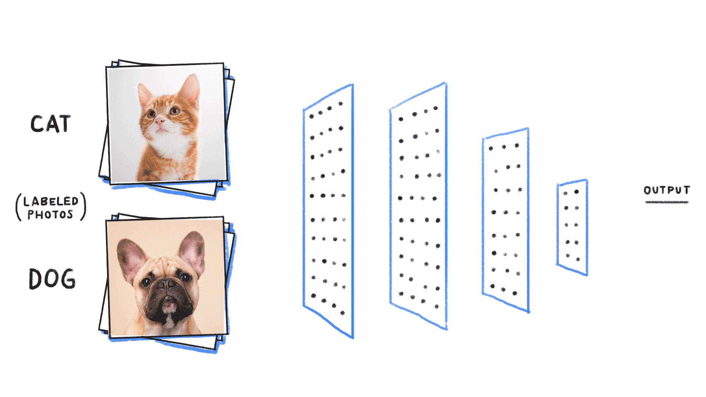
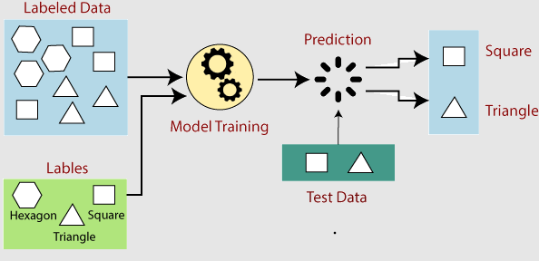

# 机器学习 (Machine Learning) 笔记

## 机器学习 (Machine Learning)基础

### 1. 什么是机器学习？
  机器学习是人工智能的一个分支，其核心思想是让计算机通过数据进行学习，而不是通过显式的编程规则来执行任务。

  * **核心目标**：从数据中发现规律，从而对未知数据进行预测或决策。
  * **本质**：通过数学模型（函数）拟合数据分布。

### 2. 机器学习的核心分类
  机器学习通常分为以下几大类：

#### 2.1 监督学习 (Supervised Learning)
  * **定义**：模型在已知输入（特征）和输出（标签）的数据集上进行训练。
  * **典型任务**：
      * **回归 (Regression)**：预测连续值（如房价预测）。
      * **分类 (Classification)**：预测离散类别（如垃圾邮件识别）。

#### 2.2 无监督学习 (Unsupervised Learning)
  * **定义**：模型仅利用未标记的数据进行训练，尝试发现数据内在的结构。
  * **典型任务**：
      * **聚类 (Clustering)**：将数据划分为若干组（如用户群体细分）。
      * **降维 (Dimensionality Reduction)**：简化数据特征（如主成分分析 PCA）。

#### 2.3 强化学习 (Reinforcement Learning)
  * **定义**：智能体（Agent）通过与环境的交互，根据奖励（Reward）机制来学习最优策略。

### 3. 机器学习的核心流程
  一个标准的机器学习项目通常遵循以下步骤：

  1.  **数据收集**：获取原始数据。
  2.  **数据预处理**：清洗、缺失值填充、特征缩放（标准化/归一化）。
  3.  **模型选择**：根据任务选择算法（如线性回归、决策树、支持向量机等）。
  4.  **模型训练 (Fit)**：利用训练集调整模型参数。
  5.  **模型评估 (Evaluate)**：使用测试集验证模型性能（准确率、均方误差等）。
  6.  **超参数调优**：优化模型效果。

### 4. 关键概念
  * **过拟合 (Overfitting)**：模型在训练集上表现极好，但在测试集上表现较差（模型太复杂，“死记硬背”）。
  * **欠拟合 (Underfitting)**：模型在训练集和测试集上表现都不好（模型太简单）。
  * **偏差-方差权衡 (Bias-Variance Tradeoff)**：寻找模型复杂度和泛化能力之间的平衡点。

### 5. 常用工具栈
  * **NumPy**：高效数值计算。
  * **Pandas**：数据处理与分析。
  * **Matplotlib/Seaborn**：可视化。
  * **Scikit-learn (sklearn)**：机器学习算法实现的标准库。

## 机器学习 (Machine Learning) 导论

### 1. 核心定义
机器学习是人工智能（AI）的一个子领域，它赋予计算机无需通过显式编程即可“学习”的能力。
* **传统编程**：输入数据 + 规则 = 输出结果。
* **机器学习**：输入数据 + 输出结果 = 规则（模型）。

### 2. 为什么需要机器学习？
* **处理复杂任务**：当规则过于复杂（如人脸识别、语音转文字）而无法通过人工编写代码实现时。
* **适应性**：系统能随数据变化而自动更新和改进，具备自我进化的能力。
* **挖掘隐含规律**：从海量数据中发现人类难以察觉的统计学特征。

### 3. 机器学习的应用场景
* **预测类**：房价预测、股票走势、销量预估（回归任务）。
* **分类类**：邮件过滤、图像识别、信用评分（分类任务）。
* **聚类类**：客户细分、异常检测、社交网络社区发现（无监督任务）。

### 4. 机器学习的“进化”逻辑
机器学习的本质是一个迭代过程：
1. **输入数据**：模型通过观测数据。
2. **构建模型**：利用数学算法（如线性回归、神经网络）构建映射关系。
3. **误差评估**：计算预测值与真实值之间的差异（Loss）。
4. **参数优化**：调整参数以最小化误差，使其在面对新数据时表现更好。

</img>

</img>

## 机器学习 (Machine Learning) 学习路径建议

### 1. 知识储备先行
在深入算法之前，需要具备以下基础：
* **数学基础**：线性代数（矩阵运算）、概率论与统计学（基础分布与推理）、微积分（梯度与导数）。
* **编程基础**：精通 Python，尤其是数据处理库（NumPy, Pandas, Matplotlib）。

### 2. 学习的三大阶段
* **第一阶段：夯实理论基础**
    * 理解核心概念：监督/无监督/强化学习、偏差-方差权衡、过拟合/欠拟合。
    * 不要陷入纯数学公式的泥潭，重点在于理解算法的“直觉”。
* **第二阶段：工具实操**
    * 熟练使用 `Scikit-learn`：这是机器学习的入门标准库。
    * 通过“跑通”简单的算法（如线性回归、决策树、SVM）来建立对数据的敏感度。
* **第三阶段：项目驱动与竞赛**
    * 参与 Kaggle 竞赛：在真实数据集中处理脏乱数据、进行特征工程。
    * 复现经典论文或项目：通过 GitHub 寻找开源项目，动手实现并调试。

### 3. 学习心法
* **动手胜过阅读**：不要只看视频或书籍，每一行算法都应该通过代码运行一遍。
* **由浅入深**：先从简单的统计模型开始，再过渡到复杂的神经网络（深度学习）。
* **保持持续更新**：机器学习领域发展迅速，多阅读 arXiv 论文和行业技术博客。

## 机器学习项目生命周期 (Machine Learning Project Lifecycle)

### 1. 核心理念
机器学习项目不是线性的“一锤子买卖”，而是一个**迭代循环**的过程。一旦模型部署，随着数据环境的变化，还需要持续进行监测与重训练。

### 2. 标准生命周期阶段
一个完整的机器学习项目通常经历以下核心环节：

1. **定义问题 (Scoping & Problem Definition)**
   * 明确目标：判断机器学习是否是解决问题的最优方案。
   * 设定标准：确定衡量模型性能的业务指标（如准确率、召回率、F1 分数等）。
   * 框架化：将业务需求转化为具体的机器学习任务（回归、分类或聚类）。

2. **数据处理 (Data Processing)**
   * 数据获取：收集原始数据（数据库、API、文件等）。
   * 数据清洗：处理缺失值、异常值和不一致数据，确保数据质量。
   * 特征工程 (Feature Engineering)：这是最体现专家经验的一步，包括特征转换、提取和选择，旨在提高模型对数据的理解能力。

3. **建模与训练 (Modeling & Training)**
   * 模型选择：基于问题性质选择合适的算法（如逻辑回归、SVM、随机森林或深度学习模型）。
   * 训练循环：通过大量数据进行参数训练，并根据验证集表现进行超参数调优。

4. **模型评估 (Evaluation)**
   * 模型测试：使用未参与训练的测试集（Unseen Data）进行评估。
   * 误差分析：分析模型犯错的模式，反推是数据质量问题还是模型结构缺陷，从而决定是否回到“数据处理”或“建模”阶段进行迭代。

5. **部署与集成 (Deployment & Integration)**
   * 环境搭建：将训练好的模型封装（如 API 服务、容器化部署），集成到现有的业务系统或移动端应用中。

6. **监测与维护 (Monitoring & Maintenance)**
   * 持续监控：监测模型在生产环境中的性能，检测是否存在“数据漂移”（Data Drift，即线上数据分布与训练时发生变化）。
   * 迭代升级：根据反馈定期重训练模型，保证模型随环境进化。

## 机器学习如何工作

### 核心思想

机器学习核心是让计算机通过**数据学习**推断规律 / 模式，无需显式编写规则；本质是通过历史数据，自动改进决策与预测能力。

### 简化工作流程

1. 收集数据：准备含特征和标签的数据
2. 选择模型：按任务选合适机器学习算法
3. 训练模型：数据学习模式，最小化误差
4. 评估与验证：测试集评估性能并优化
5. 部署模型：投入实际场景做预测
6. 持续改进：随新数据定期更新优化

### 核心环节详解

#### 1. 数据输入：学习基础

- **输入特征**：模型预测依据（如房价预测中的面积、位置）
- **标签**：待预测结果（如房价）
- 目标：挖掘特征与标签间的关联规律

#### 2. 模型选择：匹配任务的算法

- **监督学习**：带标签数据，学输入 - 标签关系（如线性回归、逻辑回归、SVM、决策树）
- **无监督学习**：无标签数据，探索数据结构（如 K-means 聚类、PCA）
- **强化学习**：与环境互动，靠奖惩学最优行为（如 Q-learning、DQN）

#### 3. 训练过程：数据中习得规律

- 核心：通过**最小化损失函数**优化模型参数

- 步骤：

  1. 初始化：参数随机赋值
  2. 算预测：输入数据生成预测结果
  3. 算误差：对比预测值与真实标签
  4. 调参数：用梯度下降 / 反向传播缩小误差，循环至最优

  

#### 4. 验证与评估：检验模型性能

- 数据划分：**训练集**（训练用）、**测试集**（评估用，不参与训练）

- 常用指标：

  - 分类：准确率、精确率、召回率、F1 分数
  - 回归：均方误差（MSE）

  

#### 5. 优化与调整：提升模型精度

- 调超参数：学习率、正则化系数、树深度等
- 模型优化：尝试新模型或集成学习（随机森林、XGBoost）
- 数据增强：扩展数据集（如图像旋转、翻转），增强泛化能力

#### 6. 模型部署与预测：落地应用

- 部署：将训练好的模型嵌入应用、网站、服务器
- 预测：接收新数据，输出实时预测 / 分类结果

#### 7. 持续学习：长期维护

- 模型非一次性完成，需随新数据**定期更新、再训练**
- 常用方法：在线学习、迁移学习

| 模型类型     | 中文全称       | 英文简写    | 核心适用场景                 | 优点                             | 缺点                                    |
| ------------ | -------------- | ----------- | ---------------------------- | -------------------------------- | --------------------------------------- |
| 传统机器学习 | 决策树         | DT          | 分类、回归、特征重要性分析   | 可解释性强，无需数据归一化       | 易过拟合，对噪声敏感                    |
| 传统机器学习 | 随机森林       | RF          | 分类、回归、异常检测         | 抗过拟合，稳定性高               | 高维数据下计算成本高                    |
| 传统机器学习 | 逻辑回归       | LR          | 二分类、概率预测             | 训练快，可解释性强               | 难以拟合非线性关系                      |
| 传统机器学习 | 支持向量机     | SVM         | 分类、高维小样本数据         | 泛化能力强，适合特征维度高的场景 | 对大规模数据训练慢，调参复杂            |
| 传统机器学习 | 朴素贝叶斯     | NB          | 文本分类、垃圾邮件识别       | 训练速度极快，对缺失数据不敏感   | 假设特征独立，实际场景中可能不成立      |
| 传统机器学习 | XGBoost        | XGBoost     | 分类、回归、竞赛级任务       | 精度高，支持并行计算，自带正则化 | 容易过拟合，对超参数敏感                |
| 传统机器学习 | LightGBM       | LightGBM    | 大规模数据分类、回归         | 训练速度快，内存占用低           | 小数据集上可能不如 XGBoost 稳定         |
| 深度学习     | 人工神经网络   | ANN         | 简单分类、回归任务           | 结构简单，易于理解               | 难以处理高维、复杂数据                  |
| 深度学习     | 卷积神经网络   | CNN         | 图像识别、目标检测、视频分析 | 自动提取空间特征，参数共享       | 训练需要大量数据和计算资源              |
| 深度学习     | 循环神经网络   | RNN         | 序列数据处理、文本生成       | 处理可变长度序列                 | 存在梯度消失 / 爆炸问题，难以捕捉长依赖 |
| 深度学习     | 长短期记忆网络 | LSTM        | 长序列文本翻译、语音识别     | 解决 RNN 长依赖问题              | 结构复杂，训练速度较慢                  |
| 深度学习     | 门控循环单元   | GRU         | 序列数据处理、情感分析       | 比 LSTM 结构简单，训练更快       | 长序列场景下性能略逊于 LSTM             |
| 深度学习     | 生成对抗网络   | GAN         | 图像生成、风格迁移、数据增强 | 生成数据质量高，多样性强         | 训练不稳定，容易模式崩溃                |
| 深度学习     | Transformer    | Transformer | 自然语言处理、多模态任务     | 并行计算效率高，捕捉长依赖能力强 | 计算成本高，小数据集上易过拟合          |
| 深度学习     | 自编码器       | AE          | 数据压缩、异常检测、特征提取 | 无监督学习，结构简单             | 生成数据质量通常低于 GAN                |
| 深度学习     | 图神经网络     | GNN         | 社交网络分析、分子结构预测   | 处理图结构数据，挖掘节点关系     | 训练难度大，对图结构预处理要求高        |
